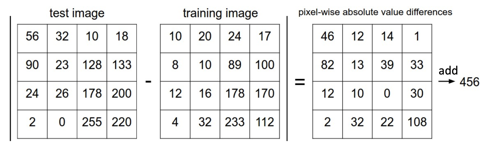
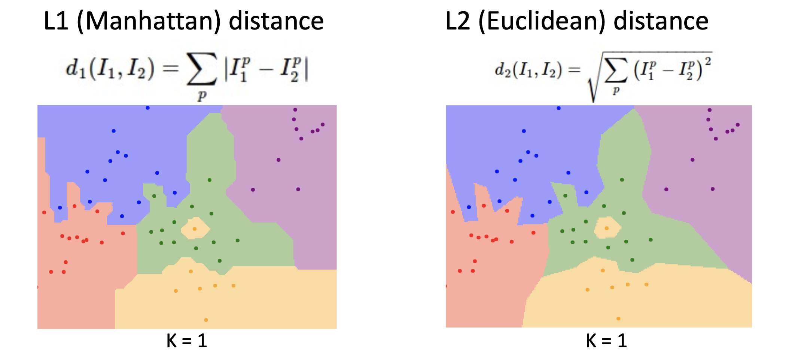
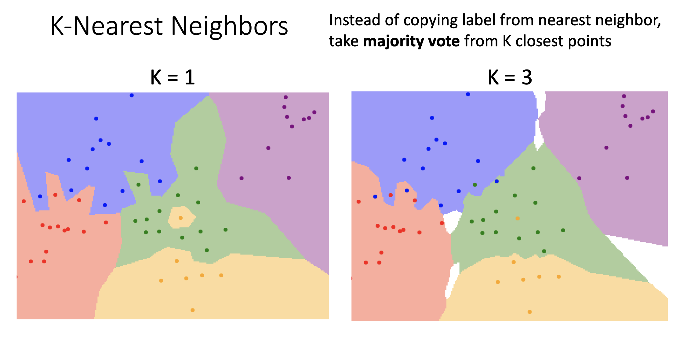
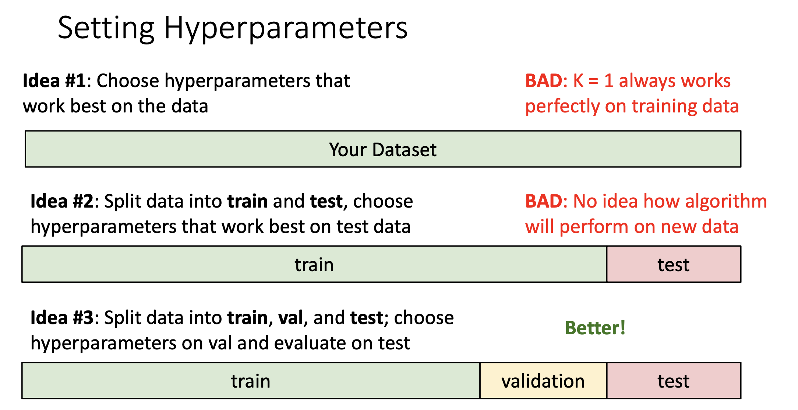
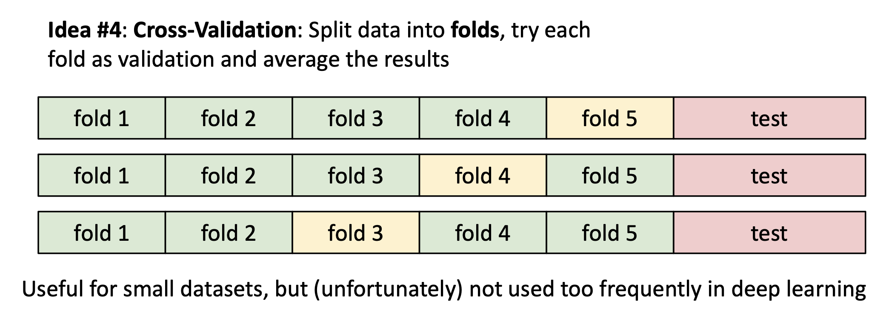
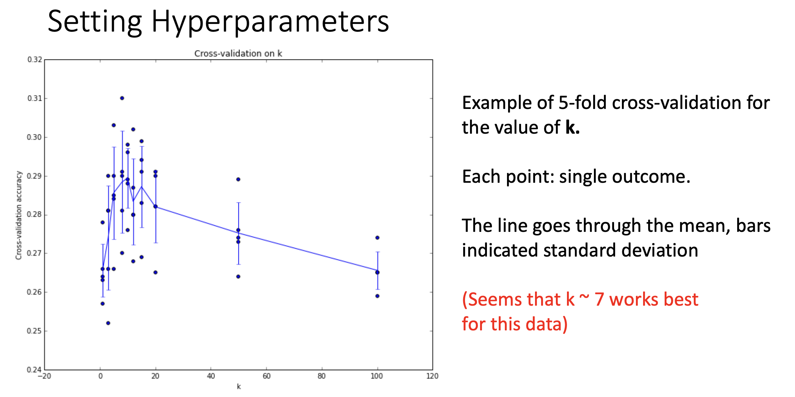

# kNN (K Nearest Neighbors)

## Overview

kNN是一种懒惰学习算法，意味着它其实不需要进行训练就可以直接用于预测。它的基本步骤如下：

- 选取合适的距离度量 (Distance Metric) 用于衡量测试样本和训练样本之间的距离
  - 曼哈顿距离，欧几里得距离...
- 根据距离度量得到测试样本和所有训练样本之间的距离，选取k个最近的训练样本
  - 可以等权重地设置k个邻居的影响，也可以按照距离进行加权得到k个邻居的影响
- 统计k个邻居中出现次数最多的类别，将该测试样本分入该类

## 距离度量 (Distance Metric) 

- 曼哈顿距离 (Manhattan Distance): $d(I_1, I_2) = \sum{|I_1 - I_2|}$

- 欧几里得距离 (Euclidean Distance): $d(I_1, I_2) = \sqrt{\sum{{(I_1 - I_2)}^2}}$

曼哈顿距离和欧几里得距离的区别在于，用曼哈顿距离得到的决策边界更加方正，边界是水平线、垂直线、45度斜线等；用欧几里得距离得到的决策边界更加圆润，可以是任意方向的线。

## k的影响

当k很小时，每个测试样本的分类完全取决于最近一个邻居的类别，模型很容易受到噪声的影响，决策边界会变得更复杂，导致过拟合。

当k很大时，模型可能会过于平滑，无法很好地捕捉数据之间的关系，导致欠拟合。

可以通过这个[链接](http://vision.stanford.edu/teaching/cs231n-demos/knn/)更直观地得到k, 距离度量对于kNN分类结果的影响。

## 超参数 (Hyperparameter)

- What's the best value for k to use?
- What's the best distance metric to use?

k和距离度量都属于超参数：**由人来设置的参数，而不是通过算法学习得到的参数**。超参数的设定非常地依赖具体问题具体分析，一般来说都需要都尝试一下然后看哪一个效果更好。

### 如何设定超参数

将数据集划分为训练集 (Training Set), 验证集 (Validation Set), 测试集 (Test Set)：

- 训练集：设定好超参数后，用于训练模型参数
- 验证集：验证模型在该超参数下的表现情况，根据表现情况调整超参数
- 测试集：不能用于更改超参数，只能用于评价模型的好坏

将数据集分为训练集、验证集、测试集的原因在于**不让测试集被污染，保障模型的泛化能力**，在未见过的数据集上也能表现良好。

所谓污染，指的是模型训练的过程中有意无意地使用了测试集的数据，导致模型在测试集上表现得过于乐观，但是在面对新数据时却表现不佳，泛化能力变差。

#### 交叉验证 (Cross Validation)

- 将数据集划分为不同的折 (Fold)

- 得到在该超参数下在不同验证集上的模型正确性，对模型正确性取平均值，就得到了该超参数下最终的模型正确性

