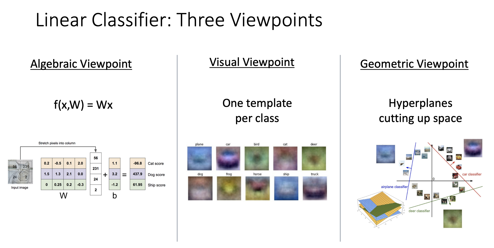
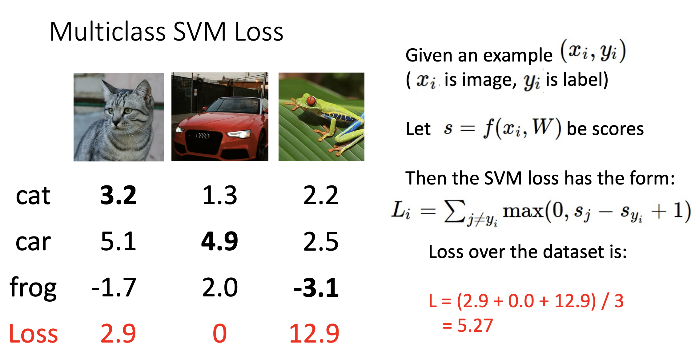
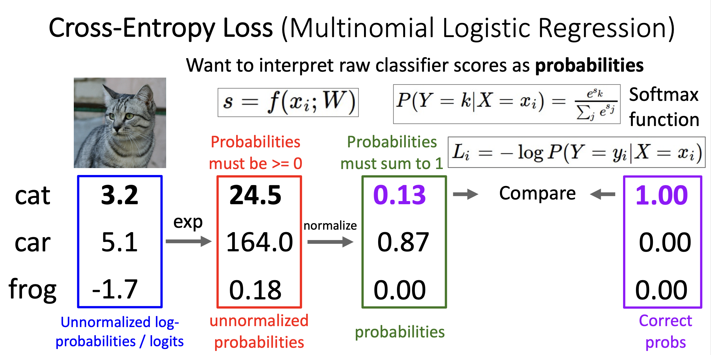
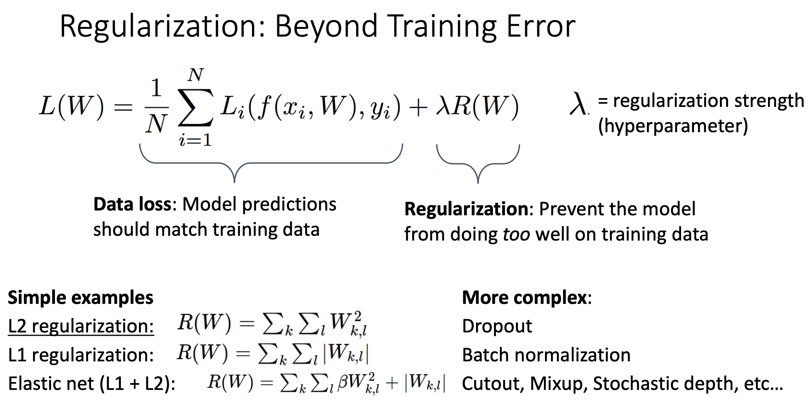

# Linear Classifier

## 如何理解线性分类器

线性分类器是一种基于线性决策边界的分类模型，它的核心思想是使用超平面 (Hyperplane) 将不同类别的数据点分开。一个训练好的线性分类器相当于一个容器，能够将扔入这个容器之中的数据进行分类。

在线性分类器中，可以将输入特征组合为一个大小为 $m * n$ 的矩阵 $\vec{X}$，权重矩阵是大小为 $n * c$ 的 $\vec{W}$，每个类别的偏差矩阵 $\vec{b}$ 是全局共享的，大小为 $1 * c$ ，通过**广播机制**和 $\vec{X} \cdot \vec{W}$ 进行运算。其中m, n, c分别是样本数、特征数、类别数。

$\hat{y} = \vec{X} \cdot \vec{W} + \vec{b}$ 得到的是一个大小为 $m * c$ 的矩阵，**每一行表示该样本在不同类别中的得分**。

## Loss Function

损失函数 (Loss Function) 又称作目标函数 (Objective Function) 或者成本函数 (Cost Function) ，它能够告诉你这个模型的能力如何：

- High loss = bad model
- Low loss = good model

### Multi-Class SVM Loss

对于一组数据集中的第i个数据 $(x_i, y_i)$ , $x_i$ , $y_i$ 分别是特征和标签，大小分别为 $1 * n, 1 * c$ 。可以根据线性分类器模型函数得到该数据的预测分类 $\hat{y_i}$ ，大小和 $y_i$ 相同，都为 $1 * c$ 。记 $\hat{y_i}$ 中各个类别的分数为 $s_j$ , $\hat{y_i}$ 中正确类别的分数为 $s_{y_i}$ 。

则**Multi-Class SVM Loss**可以表示为: $loss = \sum_{j \neq y_i}{max(0, s_j - s_{y_i} + \Delta)}$ 。$\Delta$ 被称作**超间隔参数**，通常被设置为1，但可以调整，**这表示当正确分类的得分比任何其它分类的得分高 $\Delta$ 数值时，损失为0**。

在整个数据集上的损失就是 $\frac{1}{m}\sum_{i=1}^{m}{loss_i}$ 。

### Cross-Entropy Loss

对于一组数据集中的第i个数据 $(x_i, y_i)$ ，$x_i, y_i$ 分别是特征和标签，大小分别为 $1 * n, 1 * c$ 。可以根据线性分类器模型函数得到该数据的预测分类 $\hat{y_i}$ ，大小和 $y_i$ 相同，都为 $1 * c$ 。

对 $\hat{y_i}$ 中每个类别的分数进行**Softmax归一化**, $z_j = \frac{\exp^{\hat{y_{ij}}}}{\sum{\exp^{\hat{y_i}}}}$ , $z_j$ 可以看作 $x_i$ 被划分入j类别的概率。**损失函数可以表示为: $loss = -\log{z_{y_i}}$ , $z_{y_i}$ 为正确类别的softmax概率**。

在整个数据集上的损失就是 $\frac{1}{m}\sum_{i=1}^{m}{loss_i}$ 。

## 正则化 (Regularization) 

在成本函数中加入正则项，对模型的参数进行一些限制，可以**避免出现过拟合**或者**对参数的分布表达一些倾向**。$\lambda$ 是一个超参数，表明正则化在整个成本函数中的权重 (The tradeoff between minimizing cost function and avoiding overfitting)。

