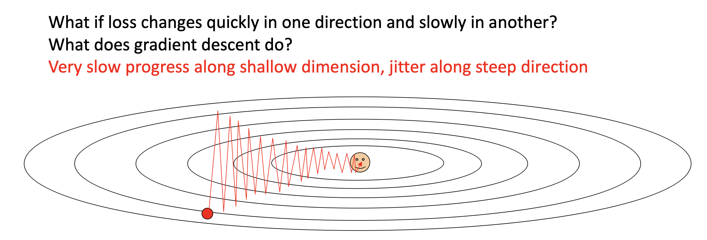
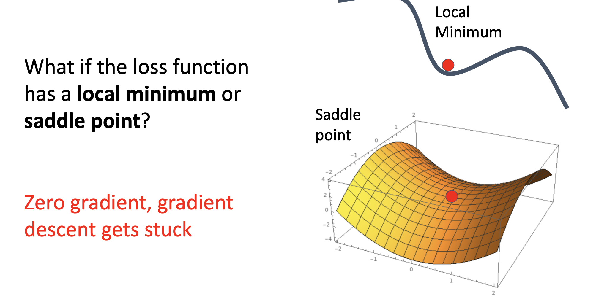
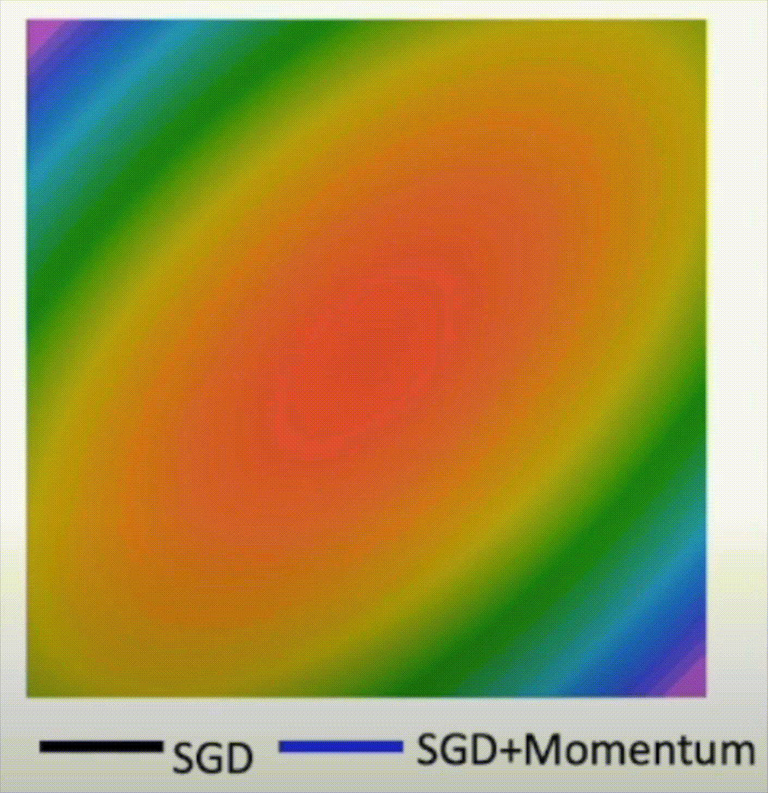
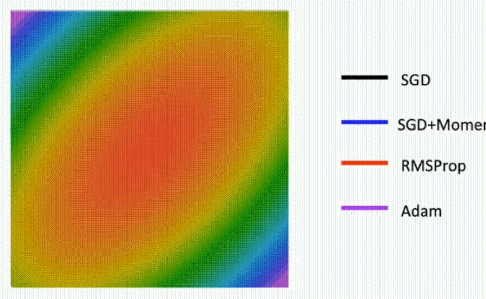

# Optimization

## Gradient Descent

梯度下降是一种用于寻找函数最小值的算法。**为了找到使成本函数最小化的参数，梯度下降算法沿着成本函数的梯度负方向不断更新参数，直到损失函数收敛到一个最小值**。值得注意的是，梯度下降算法只能得到**局部最小值**，这和设置的成本函数的起始参数有关。

可以通个这个[链接](http://vision.stanford.edu/teaching/cs231n-demos/linear-classify/)更直观地了解到如何在线性分类器中实现梯度下降。


### Batch Gradient Descent

**批量梯度下降**是在整个训练集上的成本函数进行梯度下降算法。

- 优点：在整个训练集上进行梯度下降，梯度估计相对准确，较少地降低误差
- 缺点：由于是在整个训练集上进行梯度下降，计算开销非常庞大，速度慢

````python
# batch gradient descent
w = initialize_weights()
for i in range(epochs):
  dw = compute_gradient(loss_function, data, w)
  w -= learning_rate * dw
````

### Stochastic Gradient Descent

**随机梯度下降**是在整个训练集中随机选取一个训练子集来进行梯度下降训练。

<!--一般来说，批量的大小通常是32/64/128...-->

- 优点：由于样本数量的减少，计算效率和速度都大大提高
- 缺点：由于样本数量的减少，**噪声更大**，梯度可能会有一定偏离

````python
# stochastic gradient descent
w = initialize_weights()
for i in range(epochs):
  minibatch = sample_data(data, batch_size)
  dw = compute_gradient(loss_function, minibatch, w)
  w -= learning_rate * dw
````

在实际的运用中，**一般使用随机梯度下降而非全批量梯度下降**。

## SGD++

### SGD的问题

- 当成本函数在某个方向上的梯度很大，在另一个方向上的梯度很小时，这会导致成本函数会出现来回大幅度波折的情况，收敛缓慢，消耗大量时间和计算资源



- 当成本函数梯度下降到局部最小值或者梯度为零的点时，可能会一直卡在这里，无法进一步梯度下降



### SGD + Momentum

SGD + Momentum的意思是，在进行梯度下降时**给梯度增加一个动量**，使它能够在下降时获得一定的**加速度**（想象在山坡中沿着斜坡下滑的小球，它在下降的时候也会具有一个加速度）。

````python
# SGD + Momentum
w = initialize_weights()
v = 0
for i in range(epochs):
  dw = compute_gradient(w)
  v = rho * v + dw # rho表示"摩擦力"，通常为0.9或者0.99
  w -= learning_rate * v
````

SGD + Momentum能够在**部分局部最小值或者梯度为零的点脱困**，继续进行梯度下降（想象山坡中沿着斜坡下降的小球遇到了小坑或者小块平地，它不会卡在这里），另外它的下降速度会更快。详情可以参考[Sutskever et al, “On the importance of initialization and momentum in deep learning”, ICML 2013](https://www.cs.toronto.edu/~fritz/absps/momentum.pdf)。



### RMSProp

Root Mean Squared Propagation在梯度下降时引入了一个**自适应的学习率机制**，能够有效加快收敛，同时能够有效避免出现SGD + Momentum时出现的overshooting情况。

````python
# RMSProp
w = initialize_weights()
grad_squared = 0
for i in range(epochs):
  dw = compute_gradient(w)
  grad_squared = decay_rate * grad_squared + (1 - decay_rate) * (dw ** 2) # decay_rate控制grad_squared的衰减程度，通常取0.9或者0.99
  w -= learning_rate / (grad_squared.sqrt() + 1e-7) * dw # 1e-7是一个非常小的数值，用于防止grad_squared.sqrt()=0，发生除以0的情况
````


### Adam (SGD + Momentum + RMSProp)

Adaptive Movement Estimation算法**结合了动量和自适应学习率**，进一步提升了梯度下降时的效率和稳定性。

````python
# Adam
w = initialize_weights()
moment1, moment2 = 0
for i in range(epochs):
  dw = compute_gradient(w)
	# beta1, beta2都是超参数
  moment1 = beta1 * moment1 + (1 - beta1) * dw
  moment2 = beta2 * moment2 + (1 - beta2) * (dw ** 2)
  moment1_unbias = moment1 / (1 - beta1 ** i)
  moment2_unbias = moment2 / (1 - beta2 ** i)
  w -= learning_rate / (moment2_unbias.sqrt() + 1e-7) * moment1_unbias
````


