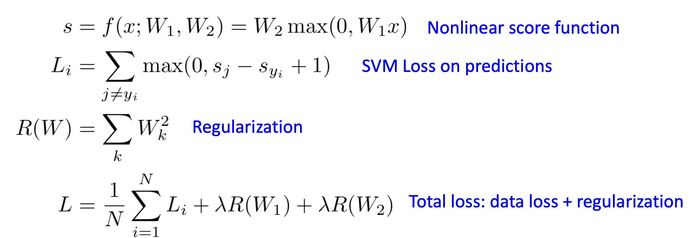

# Neural Networks

## 层 (Layers)

线性分类器并不够强大，在很多情况下它无法准确地划定决策边界，所以我们需要一个更强大的模型：神经网络。

神经网络可以是多层的，输入特征 $\boldsymbol x$ 通过第一个权重矩阵 $\boldsymbol W_1$ 与**激活函数**得到**隐藏层**，然后再次进行下一次向前传播。

当层数越来越多时，神经网络就变成了**深度神经网络** (Deep Neural Networks)。通常来说，**神经网络的层数是权重矩阵的个数**。

> 在两层或者浅层的全连接神经网络中，由于神经元 (即权重矩阵、偏差向量中的参数) 个数有限，很难取得很好的结果。一个改善的方法就是增加神经元的个数。以两层神经网络为例, $W_1$ 的形状为 $(D, H)$ , $W_2$ 的形状为 $(H, C)$ ，D, C是确定的，分别为输入数据的维度和输出的类别数, **但是H不是确定的**, **那么就可以通过扩大H来增加神经元的个数**。

## 激活函数 (Activation Function)

在以上的例子中, $f = \boldsymbol W_2 max(0, \boldsymbol W_1 \boldsymbol x)$ 中的 $max$ 函数被称为激活函数，更准确地来说, $max$ 函数是ReLU, Rectified Linear Unit 函数。

**激活函数的作用是改变线性结构**，如果没有激活函数: $f = \boldsymbol W_2 max(0, \boldsymbol W_1 \boldsymbol x) \longrightarrow f=\boldsymbol W_2 \boldsymbol W_1 \boldsymbol x$ ，实际上这还是一个线性分类器。

有许多常见的激活函数，但是ReLU是一个不易出错的默认选择。

## Convex Function

凸函数是机器学习优化中的一个重要概念，它是指在某个定义域内，**任何两点之间的连线上的值都大于或等于这两点的函数值**。简单来说，函数图像在其定义域内呈现“向上开口”的形态。

具体地来说，在二维平面上, $f(x) = x^2$ 是凸函数; $f(x) = \cos x$ 不是凸函数。

凸函数更容易优化，进行梯度下降时能够达到全局最小值 (Global Minimum)。

线性分类器就是凸函数，所以相较于神经网络，它更容易优化。

## Pipeline

