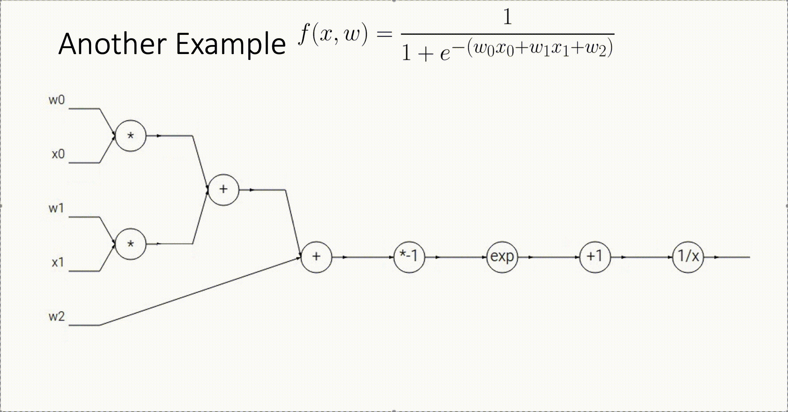

# BackPropagation

## Computational Graph

模型一旦复杂起来，手动计算权重矩阵的梯度就非常的不现实了 (tedious, unscalable, prone to errors, not modularized)。这个时候我们需要一种新的方法来计算权重矩阵的梯度: **计算图**。

计算图首先会进行一次正向传播，从左向右通过输入特征和权重矩阵计算出损失；然后再进行一次反向传播, **从右向左计算出每一层的梯度，通过链式法则得到 $\frac{\partial f}{\partial \boldsymbol W}$** 。

下图是一个更复杂情况的计算图动图：

