# Convolutional Neural Networks

## Why convolutional neural networks

之前我们学习的神经网络中的层叫做**全连接层 (fully-connected layer)**, 全连接层会**丧失输入的空间结构信息**，因为它会将输入特征都展开为一维向量然后再进行训练，不考虑输入特征的空间结构信息。

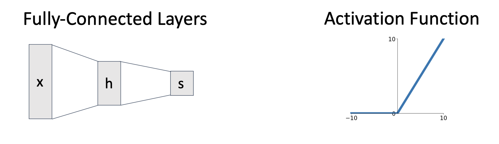

为了训练出准确度更高的模型，我们需要卷积神经网络。

## Convolutional Layer

### 单个样本单个卷积层

一张图片可以表示为大小为3\*32\*32的三维矩阵：

- 3表示图像的通道数，对应RGB (红色、绿色、蓝色) 三个颜色通道。因此图像的每个像素有三个值，分别表示红黄蓝的强度
- 32*32表示图像的高度和宽度，表明图像有32像素的高度和32像素的宽度

**卷积核是一个包含可学习权重的小矩阵，它通过与输入数据的每个局部区域进行逐元素相乘并求和的方式来提取特征**。在卷积神经网络中，卷积核通常会在输入图像上滑动，并在每个位置执行卷积操作. **卷积核的深度必须和通道数相同**。

在进行卷积操作时，卷积核会对输入数据进行滑动窗口操作，在相应的位置上进行element-wise乘积然后相加，得到**激活图 (Activation Map)**。

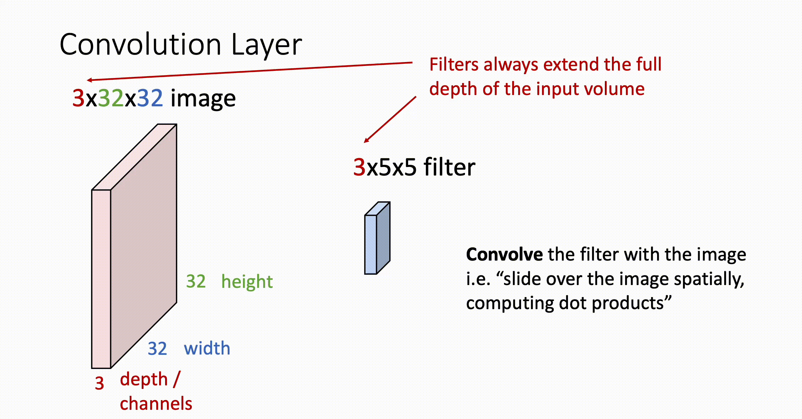

也可以使用多个卷积核，得到多个激活图，这样可以**进一步提取输入数据的特征**。

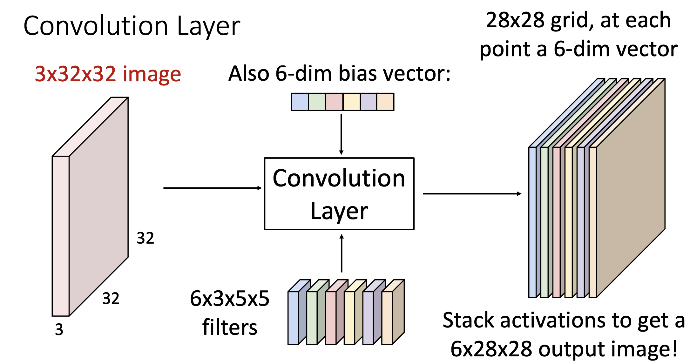

### 多个样本

输入数据可以是多个样本，组成一个大小为 $N * C_{in} * W * H$ 的四维矩阵，

- $N$ : 样本的个数
- $C_{in}$ :  单个样本的通道数
- $W, H$ : 表示单个样本的宽度和高度

卷积核也可以组成一个大小为 $C_{out} * C_{in} * K_w * K_h$ 的四维矩阵，

- $C_{out}$ : 卷积核的个数
- $C_{in}$ : 卷积核的深度，等于单个样本的通道数

- $K_w, K_h$ : 卷积核的宽度和高度

得到的激活图也是一个四维矩阵，大小为 $N * C_{out} * H' * W'$ 。

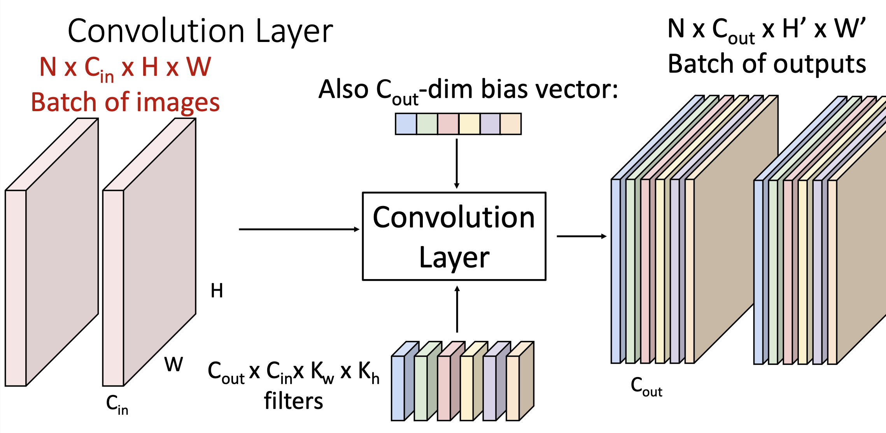

### 多个卷积层

多个卷积核组成了一个卷积层，可以使用多个卷积层提取输入数据中的信息，另外别忘了使用激活函数改变线性结构。

> - 第一个卷积层的通道数是输入数据的通道数，在彩色图像数据中，就是3
>
> - **后面卷积层的通道数是上一个卷一层的卷积核的个数**

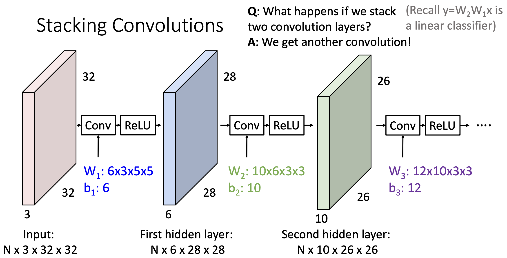

## Several Issues

### Problem 1: Shrinking Size of Hidden Layers

假设某一层输入的宽度和高度为W，卷积核的宽度和高度为K，那么该层输出的宽度和高度就为W-K+1。也就是说每经过一次卷积层，隐藏层的宽度和高度会越来越小，这样就会限制住卷积的次数。

> [见上图](#多个卷积层): $N \times 3 \times 32 \times 32 \rightarrow N \times 6 \times 28 \times 28 \rightarrow N \times 26 \times 26$ , 每一层的宽度和高度越来越小。

### Solution 1: Padding

在每一层的输入数据周围添加0，能够避免隐藏层的大小越来越小。假设某一层输入的宽度和高度为W，卷积核的宽度和高度为K，Padding的圈数为P，那么输出的宽度和高度就为W-K+1+2P。为了保持输出的宽度和高度不变，一个常见的做法是将P设置为 $\frac{K-1}{2}$ 。

> 填充为0的原因：
>
> - 保持计算的简洁：填充为0不会引入新的信息或者改变卷积的结构，从而不会影响到学习到的特征
> - 减少对模型训练的干扰：如果填充使用非零值，比如使用某个常数或者均值等，卷积操作就会受到这些值的影响，可能会使得网络学习到不合理的特征

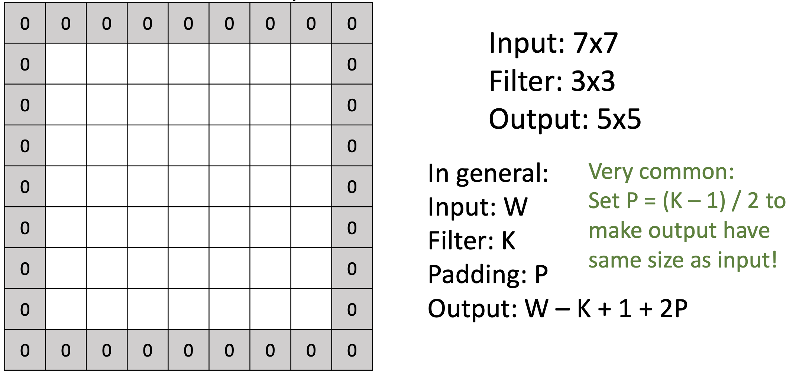

### Problem 2: Receptive Field

**感受野** (Receptive Field) 指的是**激活图中某一特定的单元能够“看到”的区域**，也就是在上一层中有哪些元素影响了它。感受野决定了激活图中每个单元能够提取到的信息量，较大的感受野能够捕捉到更广泛的特征，关注到整体上的信息。

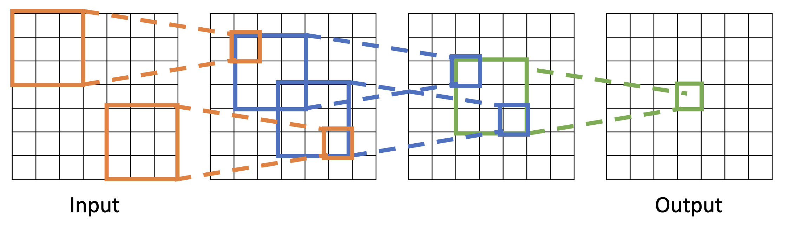

通常提高感受野的方式为使用更多卷积层，这样就能够提高激活图中每一个单元的感受野。但是问题在于对于很大的图像，我们需要很多个卷积层才能捕捉更整体上的信息，会增加很大的计算开销。

### Solution 2: Strided Convolution

改变卷积核每次滑动的步长，将标准卷积 (stride=1) 中的步长提高。总的来说，如果输入的宽度和高度为W，卷积核的宽度和高度为K，Padding的圈数为P，Stride步长为S，那么输出的宽度和高度为 $\frac{W - K + 2P}{S} + 1$ 。

- 扩大stride步长能够提高感受野，同时避免过大的计算开销
- 扩大stride步长会损失部分局部信息，可能会影响模型的精度

> 通常我们会根据输入的宽度和高度来选择能够整除的步长。

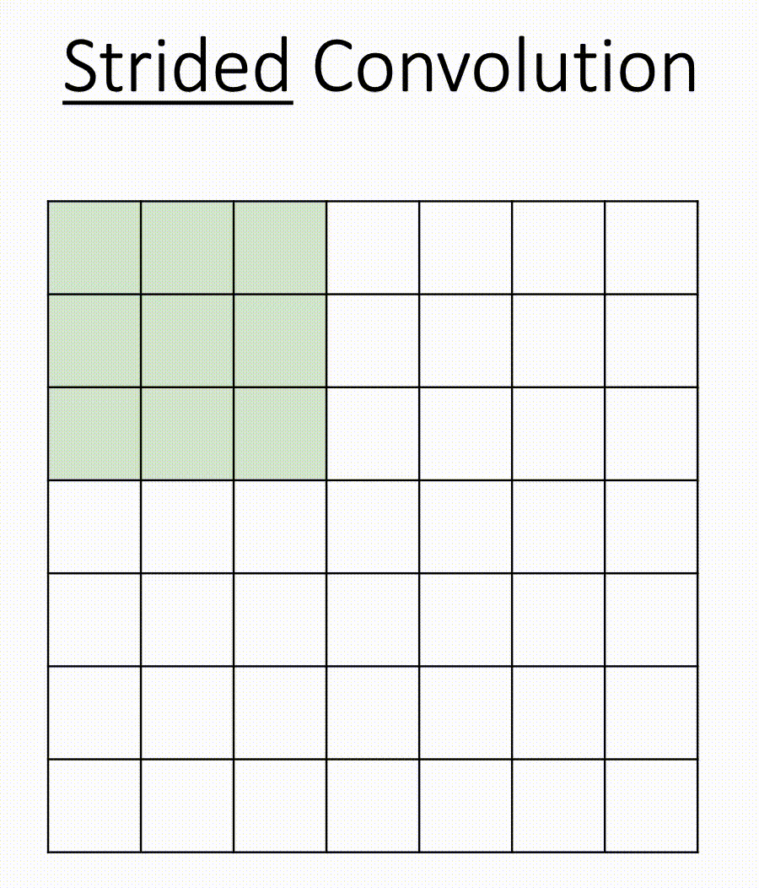

## Pooling Layer

池化 (Pooling) 是另一种减少采样 (Downsample) ，节约计算开销的方式。它可以缩小输入层/隐藏层的大小，但会失去一些精度。

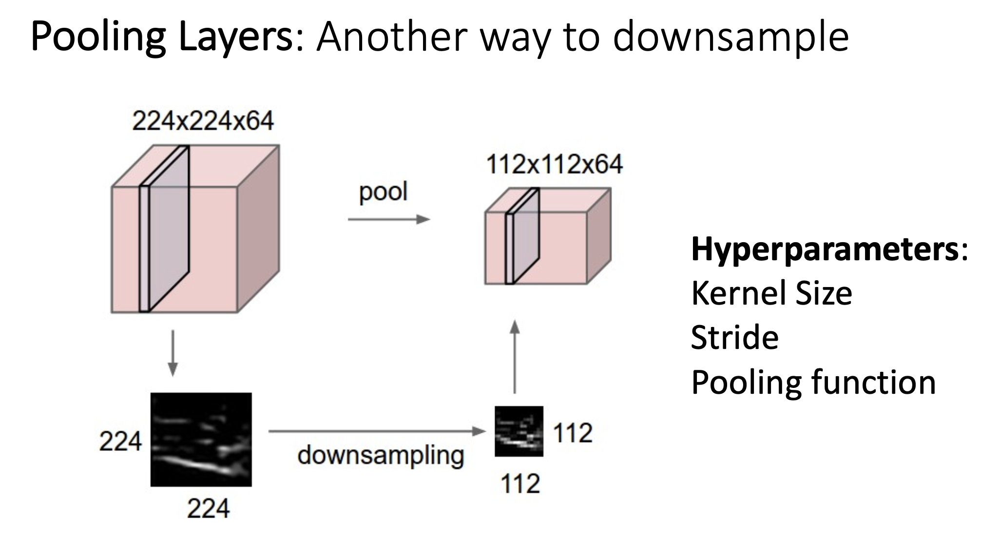

常见的Pooling方式是Max Pooling，它会将输入样本的宽度和高度划分为小区间，然后选取出每个区间内最大的值，组成一个新的样本。下图中的Max Pooling是pooling kernel的宽度和高度都为2，步长为2。

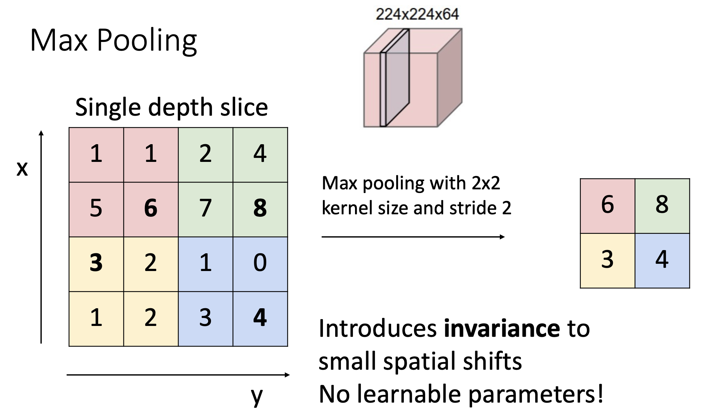

## Pipeline of LeNet-5

LeNet-5是一个经典的卷积神经网络架构，由Yann LeCun等人于1998年提出，通常用于手写识别等图像分类问题上。LeNet-5是深度学习领域的一个里程碑，展示了卷积神经网络在实际问题中的有效性。

LeNet-5的流程如下：

- 输入灰色图片，形状为1\*28\*28
- 经过一次卷积层，有20个卷积核，大小都为1\*5\*5，得到大小为20\*28\*28的隐藏层；经过ReLU激活函数后的隐藏层大小不变
- 经过一次池化层，隐藏层规模缩小到20\*14\*14
- 再次重复一遍以上过程，不过具体的参数有所改变
- 将得到的隐藏层平展
- 经过一次全连接层 (Linear + ReLU + Linear) ，得到最终的10个分类分数。

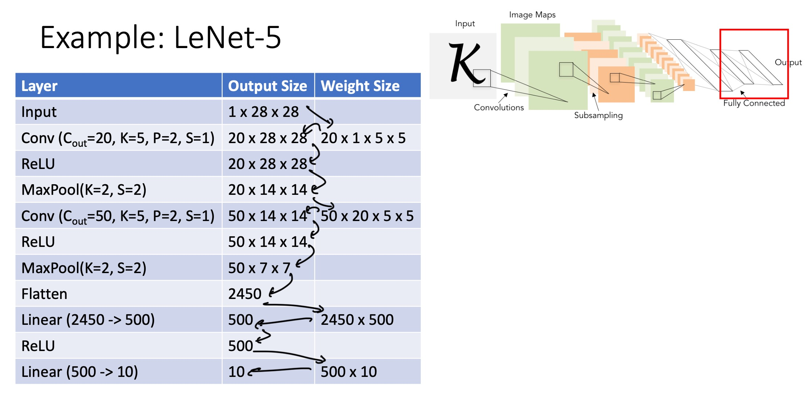

随着神经网络的进行，我们可以发现两个特征：

- Spatial size decreases (using pooling or strided convolution)
- Number of channels increases (total volume is preserved)

以后会解释为什么是这样的。

## Normalization

对某一层的输出进行归一化 (Normalization) ，让它们的均值为0并且得到统一的方差，公式为: $\hat{x}^{(k)} = \frac{x^{(k)} - E(x^{(k)})}{\sqrt{Var(x^{(k)})}}$

为什么需要归一化：

- 让深度神经网络更容易训练
- 允许设置更大的学习率，更快地让损失函数收敛
- 使神经网络在初始化时更加健壮

### Batch Normalization

对于二维输入数据，批量归一化计算方法如下：

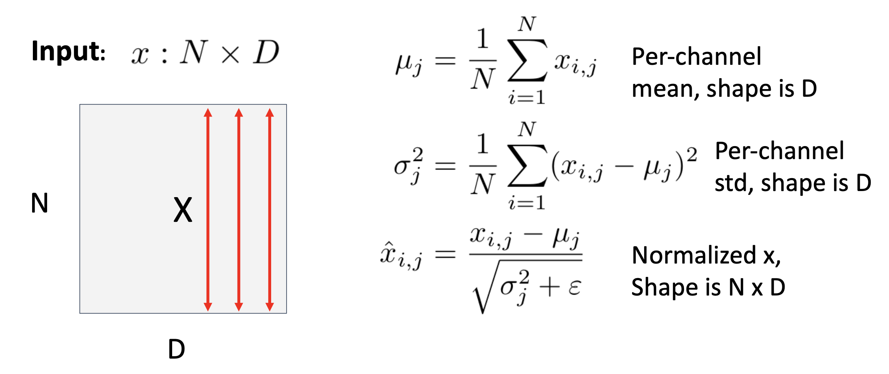

由于这样计算出来的结果“太硬”，通常会使用可学习参数进行缩放和偏移：

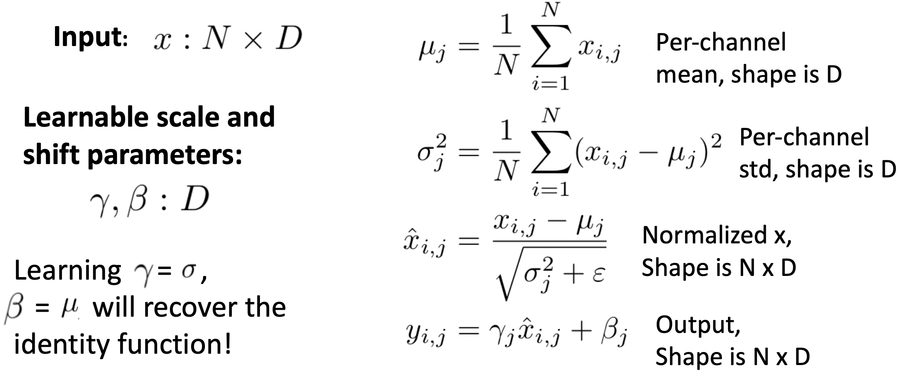

四维输入数据的批量归一化是类似的，和二维的对比如下：

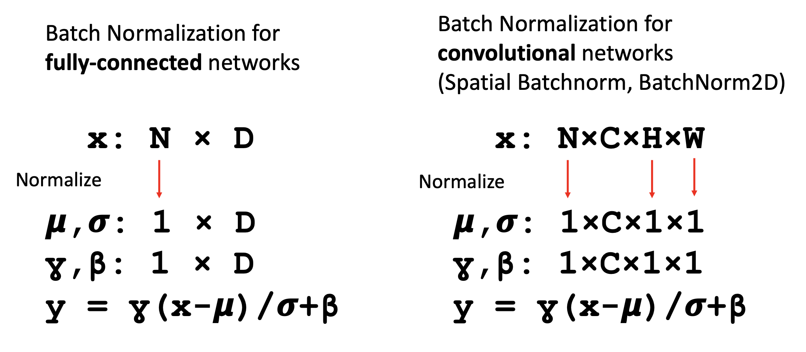

批量归一化通常放在全连接层/卷积层之后，激活函数之前：

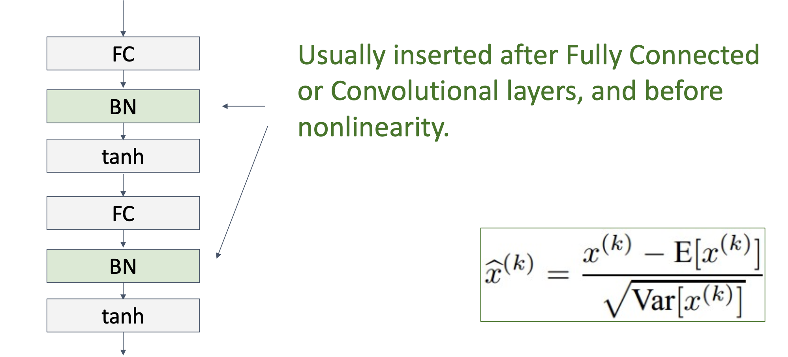

注意: **使用batch normalization时，在train-time和test-time是有区别的**。在train-time时，使用mini-batch的均值和方差来得到归一化后的结果 (如以上流程所示)；在test-time时，使用train-time时的全局均值和方差来得到归一化之后的结果 (使用全局的均值代替 $u_j$ ，全局方差代替 $\sigma_j$)。

> During testing, batch normalization becomes a linear operator because the average and variance are fixed values.
>
> Since batch normalization is a linear operator, it can be fused with its previous layer.

### Other normalization

Layer Normalization, Instance Normalization, Group Normalization...
