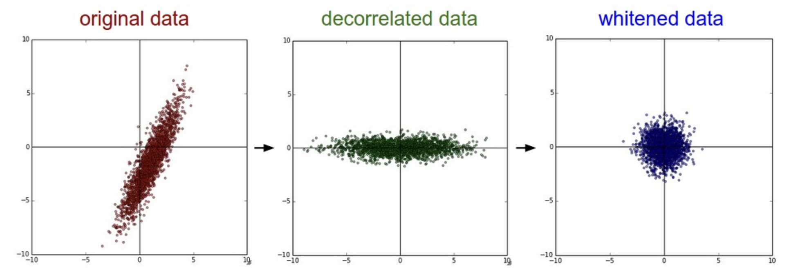
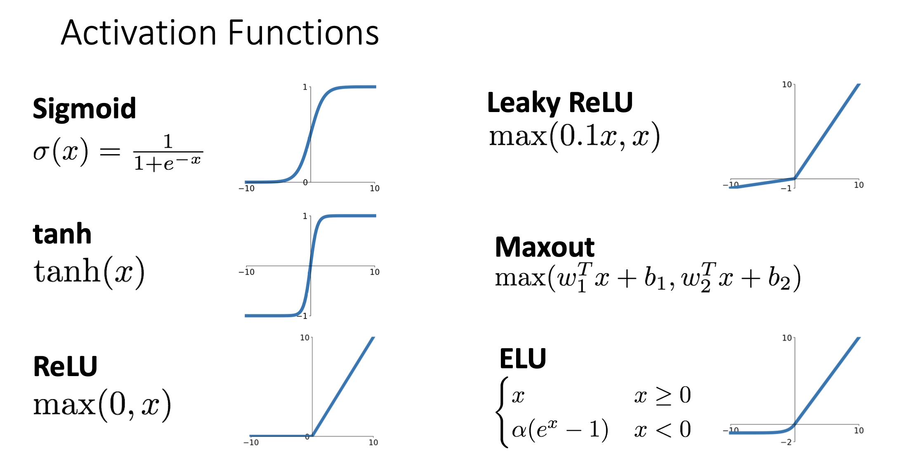

# Convolutional Neural Networks

## Why CNN

之前我们学习的神经网络中的层叫做**全连接层 (fully-connected layer)**, 全连接层会**丧失输入的空间结构信息**，因为它会将输入特征都展开为一维向量然后再进行训练，不考虑输入特征的空间结构信息。


为了训练出准确度更高的模型，我们需要卷积神经网络。卷积神经网络一般的流程：

输入层 $\rightarrow$ ([卷积层](#Convolutional-Layer) $\rightarrow$ [归一化层](#Normalization-Layer) $\rightarrow$ [激活层](#Activation-Layer)) * N $\rightarrow$ 全连接层 $\rightarrow$ 输出层

当然，在正式开始之前还有一系列的准备工作需要完成，比如[对训练数据进行预处理](#数据预处理)，便于后续进行梯度下降；比如[初始化神经元的参数](#初始化参数)，找到最合适的训练起点；比如[设置合适的学习率](#合适的学习率)，提高训练的效率；[寻找合适的正则化](#正则化)，避免出现过拟合的情况等等。在模型训练完毕之后，可能会迁移到其它模型中，这时候我们会讲一讲[迁移学习](#Transfer-Learning)是怎么回事。

## 数据预处理

一般会将训练数据标准化，便于后续进行优化。


在其它某些情况中，可能会使用PCA或者Whitening的方法。



## 初始化参数

### Xavier Initialization

**当激活函数是对称的、以0为中心时，可以使用Xavier Initialization**。Xavier 初始化的目的是保持前向传播和反向传播过程中信号的方差稳定，防止梯度消失或爆炸。

- 对于全连接层：`W = torch.randn(Dimensions, Classes) / Dimensions.sqrt()`
- 对于卷积层：`W = torch.randn(Channels, Heights, Weights) / (Channels * KernelSize * KernelSize).sqrt()`

### Kaiming Initialization

对于像ReLU这样的非对称、非以0为中心的激活函数，通常使用**Kaiming Initialization**。

- 对于全连接层：`W = torch.randn(Dimensions, Classes) * (2 / Dimensions).sqrt()`
- 对于卷积层：`W = torch.randn(Channels, Heights, Weights) * (2 / (Channels * KernelSize * KernelSize)).sqrt()`

> 只有权重需要进行Xavier Initialization或者Kaiming Initialization，偏差一般全部初始化为0。

## 合适的学习率

### Learning Rate Decay

- Step Learning Rate Decay: 根据循环的次数，逐渐减少学习率


- Cosine Learning Rate Decay: $lr_t = \frac{1}{2} lr_0(1 + \cos(\frac{\pi t}{T}))$


- Linear Learning Rate Decay: $lr_t = lr_0 (1 - \frac{t}{T})$


**使用SGD或者SGD + Momentum优化方法时，搭配learning rate decay，效果可能会更好；使用RMSProp或者Adam时，使用静态的学习率就行了**。

## 正则化

### Prevoius Methods

L1 regularization, L2 regularization...

### Dropout

Dropout的核心思想是：在训练的过程中随机丢弃一些神经元，使网络不会过度依赖于某些特定的神经元，提高模型的泛化能力。

在训练阶段，随机地将某些神经元设为0，将某个神经元设为 0的概率是超参数，通常为0.5。在测试阶段不会进行dropout操作，所有神经元都参与计算，并且乘上概率p。

````python
p = 0.5

def train():
  hidden_layer = X @ W1 + b1
  hidden_layer[hidden_layer < 0] = 0 # ReLU
  binary = (torch.rand(*hidden_layer) < p).to(hidden_layer.dtype)
  hidden_layer *= binary # drop!
  scores = hidden_layer @ W2 + b2
  
  loss = ...
  gradients = ...
  
def predict():
  hidden_layer = X @ W1 + b1
  hidden_layer[hidden_layer < 0] = 0 # ReLU
  hidden_layer *= p
  scores = hidden_layer @ W2 + b2

  y_pred = ...
````

## Convolutional Layer

### 单个样本单个卷积层

一张图片可以表示为大小为3\*32\*32的三维矩阵：

- 3表示图像的通道数，对应RGB (红色、绿色、蓝色) 三个颜色通道。因此图像的每个像素有三个值，分别表示红黄蓝的强度
- 32*32表示图像的高度和宽度，表明图像有32像素的高度和32像素的宽度

**卷积核是一个包含可学习权重的小矩阵，它通过与输入数据的每个局部区域进行逐元素相乘并求和的方式来提取特征**。在卷积神经网络中，卷积核通常会在输入图像上滑动，并在每个位置执行卷积操作. **卷积核的深度必须和通道数相同**。

在进行卷积操作时，卷积核会对输入数据进行滑动窗口操作，在相应的位置上进行element-wise乘积然后相加，得到**激活图 (Activation Map)**。


也可以使用多个卷积核，得到多个激活图，这样可以**进一步提取输入数据的特征**。


### 多个样本

输入数据可以是多个样本，组成一个大小为 $N * C_{in} * W * H$ 的四维矩阵，

- $N$ : 样本的个数
- $C_{in}$ :  单个样本的通道数
- $W, H$ : 表示单个样本的宽度和高度

卷积核也可以组成一个大小为 $C_{out} * C_{in} * K_w * K_h$ 的四维矩阵，

- $C_{out}$ : 卷积核的个数
- $C_{in}$ : 卷积核的深度，等于单个样本的通道数

- $K_w, K_h$ : 卷积核的宽度和高度

得到的激活图也是一个四维矩阵，大小为 $N * C_{out} * H' * W'$ 。


### 多个卷积层

多个卷积核组成了一个卷积层，可以使用多个卷积层提取输入数据中的信息，另外别忘了使用激活函数改变线性结构。

> - 第一个卷积层的通道数是输入数据的通道数，在彩色图像数据中，就是3
>
> - **后面卷积层的通道数是上一个卷积层的卷积核的个数**


### Several Issues

#### Problem 1: Shrinking Size of Hidden Layers

假设某一层输入的宽度和高度为W，卷积核的宽度和高度为K，那么该层输出的宽度和高度就为W-K+1。也就是说每经过一次卷积层，隐藏层的宽度和高度会越来越小，这样就会限制住卷积的次数。

> [见上图](#多个卷积层): $N \times 3 \times 32 \times 32 \rightarrow N \times 6 \times 28 \times 28 \rightarrow N \times 10 \times 26 \times 26$ , 每一层的宽度和高度越来越小。

#### Solution 1: Padding

在每一层的输入数据周围添加0，能够避免隐藏层的大小越来越小。假设某一层输入的宽度和高度为W，卷积核的宽度和高度为K，Padding的圈数为P，那么输出的宽度和高度就为W-K+1+2P。为了保持输出的宽度和高度不变，一个常见的做法是将P设置为 $\frac{K-1}{2}$ 。

> 填充为0的原因：
>
> - 保持计算的简洁：填充为0不会引入新的信息或者改变卷积的结构，从而不会影响到学习到的特征
> - 减少对模型训练的干扰：如果填充使用非零值，比如使用某个常数或者均值等，卷积操作就会受到这些值的影响，可能会使得网络学习到不合理的特征

````python
import torch.nn.functional as f

# X: (N, C, H, W)
X_padded = f.pad(X, (left, right, up, down))
# X_padded: (N, C, up + H + down, left + W + right)
````


#### Problem 2: Receptive Field

**感受野** (Receptive Field) 指的是**激活图中某一特定的单元能够“看到”的区域**，也就是在上一层中有哪些元素影响了它。感受野决定了激活图中每个单元能够提取到的信息量，较大的感受野能够捕捉到更广泛的特征，关注到整体上的信息。


通常提高感受野的方式为使用更多卷积层，这样就能够提高激活图中每一个单元的感受野。但是问题在于对于很大的图像，我们需要很多个卷积层才能捕捉更整体上的信息，会增加很大的计算开销。

#### Solution 2: Strided Convolution

改变卷积核每次滑动的步长，将标准卷积 (stride=1) 中的步长提高。总的来说，如果输入的宽度和高度为W，卷积核的宽度和高度为K，Padding的圈数为P，Stride步长为S，那么输出的宽度和高度为 $\frac{W - K + 2P}{S} + 1$ 。

- 扩大stride步长能够提高感受野，同时避免过大的计算开销
- 扩大stride步长会损失部分局部信息，可能会影响模型的精度

> 通常我们会根据输入的宽度和高度来选择能够整除的步长。


## Normalization Layer

对某一层的输出进行归一化 (Normalization) ，让它们的均值为0并且得到统一的方差，公式为: $\hat{x}^{(k)} = \frac{x^{(k)} - E(x^{(k)})}{\sqrt{Var(x^{(k)})}}$

为什么需要归一化：

- **让深度神经网络更容易训练**
- **允许设置更大的学习率，更快地让损失函数收敛**
- **使神经网络在初始化时更加健壮**

### Batch Normalization

对于二维输入数据，批量归一化计算方法如下：


由于这样计算出来的结果“太硬”，通常会使用可学习参数进行缩放和偏移：


````python
N, D = X.shape # (N, D)
epsilon = 1e-9 # 防止出现除以0的情况

mean = X.mean(dim=0) # (D,)
var = X.var(dim=0, unbiased=False) # (D,) 无偏估计：unbiased=True 有偏估计：unbiased=False

center = (X - mean) / var # (N, D)

# gamma: (D,) beta: (D,)
result = gamma * center + beta # (N, D)
````

四维输入数据的批量归一化是类似的，和二维的对比如下：


````python
N, C, H, W = X.shape # (N, C, H, W)
epsilon = 1e-9

# 计算出X中每个通道在batch中的mean和var：

# (N, C, H, W) -> (N, H, W, C) -> (N * H * W, C)
X_reshaped = X.permute(0, 2, 3, 1).reshape(-1, C)

# 接下来和二维类似了
mean = X_reshaped.mean(dim=0)
var = X_reshaped.var(dim=0, unbiased=False)
center = (X_reshaped - mean) / (var + epsilon).sqrt()

# 将形状变回来: (N * H * W, C) -> (N, H, W, C) -> (N, C, H, W)
center = center.reshape(N, H, W, C).permute(0, 3, 1, 2).contiguous()

# gamma: (1, C, 1, 1) beta: (1, C, 1, 1)
result = gamma * center + beta
````

批量归一化通常放在全连接层/卷积层之后，激活函数之前：


注意: **使用batch normalization时，在train-time和test-time是有区别的**。在train-time时，使用mini-batch的均值和方差来得到归一化后的结果 (如以上流程所示)；在test-time时，使用train-time时的全局均值和方差来得到归一化之后的结果 (使用全局的均值代替 $u_j$ ，全局方差代替 $\sigma_j$)。有时在test-time也使用其它的方法来进行归一化，比如在[A3作业中的CNN](../Assignments/A3/convolutional_networks.ipynb)就用了running average来计算mean和var，进而计算中心。

> During testing, batch normalization becomes a linear operator because the average and variance are fixed values.
>
> Since batch normalization is a linear operator, it can be fused with its previous layer.

## Activation Layer

目前已经了解到激活函数有：



Sigmoid和tanh都不是很好的选择，因为在函数的两端曲线都非常平，梯度很小，导致在反向传播时很有可能出现**梯度消失**的问题。

ReLU也存在一个问题。如果被激活的矩阵中所有参数都小于0，那么激活之后所有参数都为0，那么进行反向传播时所有梯度都为0，这会导致无法进行更新，造成"**死亡ReLU问题**"  (Dead ReLU Problem) 。但是只要还有一个参数不为0，那么就能继续更新，还有可能将已经死亡的神经元重新激活。

Leaky ReLU就是为了防止出现Dead ReLU Problem而出现的，它不会出现所有神经元都为0的情况。

一般来说使用ReLU就可以了，如果需要进一步提升0.1%的效果 (其实效果没多大差别)，可以考虑Leaky ReLU / ELU / SELU / GELU等等。反正不要使用sigmoid或者tanh。

## Pooling Layer

池化 (Pooling) 是另一种减少采样 (Downsample) ，节约计算开销的方式。它可以缩小输入层/隐藏层的大小，但会失去一些精度。


常见的Pooling方式是Max Pooling，它会将输入样本的宽度和高度划分为小区间，然后选取出每个区间内最大的值，组成一个新的样本。下图中的Max Pooling是pooling kernel的宽度和高度都为2，步长为2。


## Transfer Learning

迁移学习的核心思想是避免从头开始训练一个模型，而是对一个已经预训练好了的模型进行特定的优化，使其适应新的任务。这样做的好处是：

- 减少计算成本，不用从头开始训练大模型
- 降低数据需求，新的任务可能没有大量数据，但是这也没关系，因为预训练的模型已经学习到了一般的特征
- 加开训练速度，直接在已有的模型基础上进行调整

### 迁移学习的流程

- 选择一个预训练模型 (最好是已经在大型数据集上训练过的模型) ，比如在ImageNet上训练好的ResNet，或者在大型语料库上训练好的BERT等等
- **冻结前面的卷积层用它们来提取输入的特征 (Feature Extraction) ，仅仅训练后面的全连接层 (Fine-tuning)**

> 在深度学习中，前几层通常学习到的是低级特征，比如颜色、纹理等等；中间层学习到的是模式和形状，比如轮廓等等；后面几层学习到的是高级特征，更加整体的信息. **如果新任务和原任务相似的话，那么低级特征和中级特征是通用的，只需要训练高级特征就行了**。


