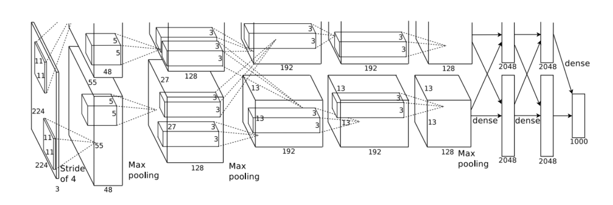
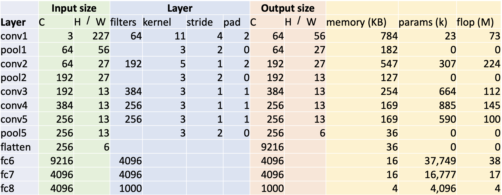
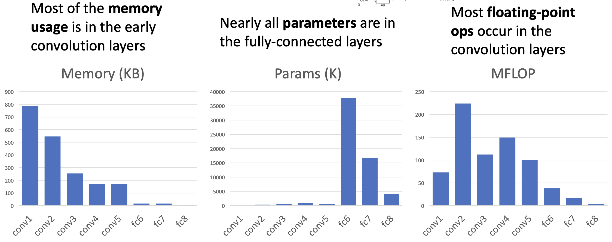
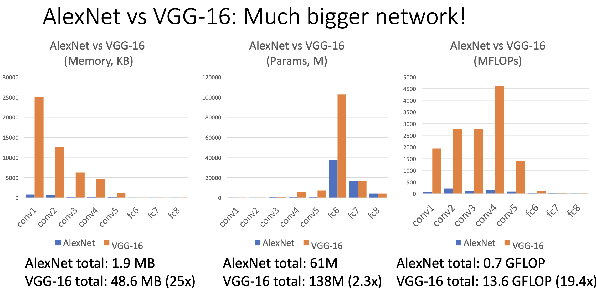
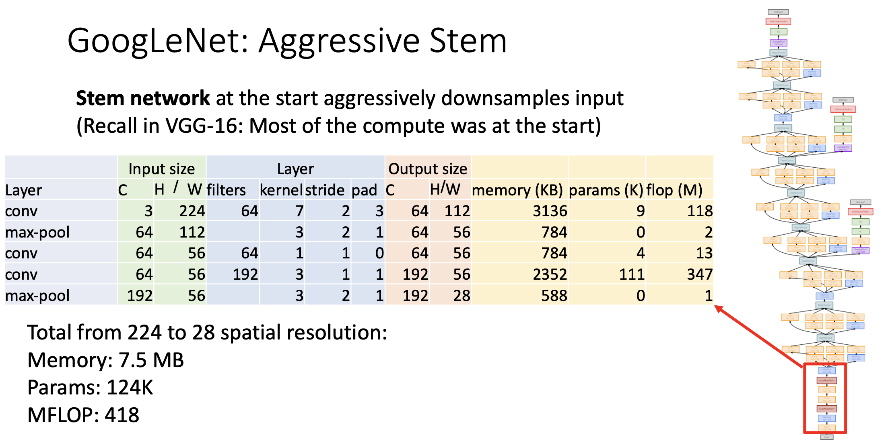
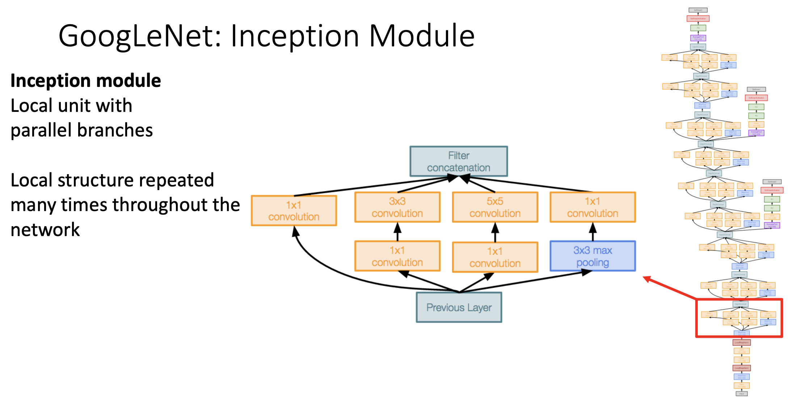
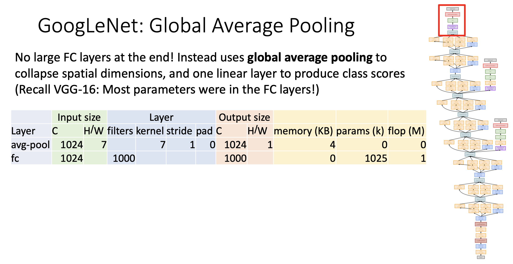
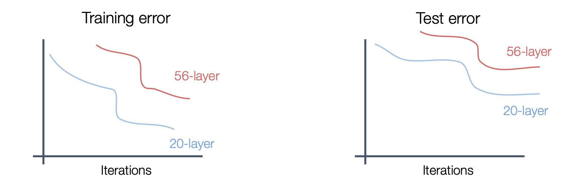
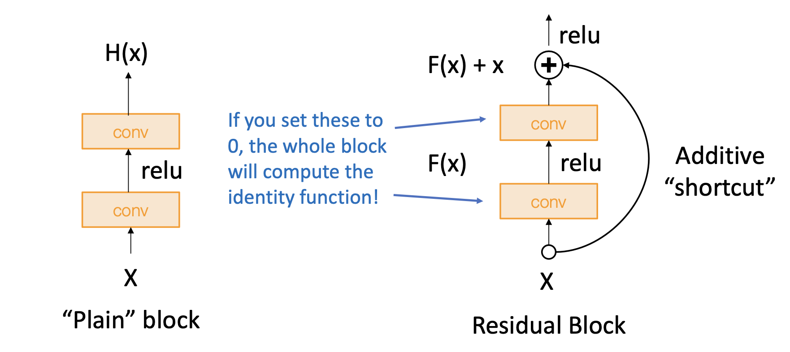

# Classical CNN Architectures

## AlexNet

AlexNet是一种深度卷积神经网络，由AI教父，2024诺贝尔物理学奖得主Geoffrey Hinton与其学生Alex Krizhevsky, Ilya Sutskever (前openAI首席科学家) 于2012年提出，并在那一年的ImageNet上取得了革命性的突破。说AlexNet是这一轮深度学习与AI浪潮的奠基之作也毫不为过。

AlexNet的组成：

- Input image size: 3 \* 227 \* 227

- 5 convolutional layers

- 5 max pooling layers
- 3 fully-connected layers
- 3 ReLU nonlinearities

### AlexNet的规模

对于单个样本，AlexNet运行的具体参数如下：

#### 计算memory

以conv1为例，输出隐藏层的大小为 $64 * 56 * 56$ ，总共有 $64 * 56 * 56 = 200704$ 个参数

因为一个32-bit浮点数占用4个字节，那么总共就占用了 $200704 * 4 = 802816$ 个字节

因为 $1 Byte = 2^{-10} KB$ ，那么就占用了784KB

#### 计算parameters

以conv1为例，参数量都在卷积核和偏差之中，

- 卷积核的参数量: $64 * 3 * 11 * 11 = 23232$

- 偏差的参数量: $64$

所以总参数量为 $23232 + 64 = 23296$

#### 计算flops

浮点数运算次数等于 (number of output elements) * (operations per output element)

- number of output elements = $64 * 56 * 56 = 200704$

- operations per output element = $3 * 11 * 11 = 363$

总的浮点数运算就为 $200704 * 363 = 72855552$ 次

### 统计特征

观察AlexNet在不同层传播时所需要的内存，参数量，浮点数运算次数可以发现以下规律：

- 需要大内存的场景通常出现在初期卷积层
- 在初期全连接层所需要的参数量最大
- 大部分的浮点数运算发生在卷积层

绝大部分卷积神经网络都具有这样的特点，可以用之后出现的VGG-16模型进行对比。

> [VGG-16](https://arxiv.org/abs/1409.1556)可以视作一个更大版的AlexNet，使用了更深的神经网络

## GoogleNet

GoogleNet于2014年由提出，它旨在确保正确率的同时提高运行的效率。它提出了三个新颖的观点：

- Stem Network
- Inception Module
- Global Average Pooling

在之前的CNN架构中，大量的内存消耗和计算消耗都发生在 (初期) 卷积层，Google团队提出了一种叫做**Stem network**的方法放在训练的最开始阶段，能够显著地降采样输入量，从而减少内存消耗和计算消耗。

在inception module这个板块中，Google团队采用了一种并行分支的方法来进行卷积。值得注意的是，在这一板块中使用了1 * 1的卷积核 (称为bottleneck) ，来减少彩色图片的通道数，在ResNet中我们会再次见到这个手法。

在之前的CNN架构中，全连接层会有大量的参数，GoogleNet通过golobal average pooling改善了这一点。它首先通过global average pooling层将图片的宽高缩为1，保留通道数，然后再通过全连接层输出最后的结果。

## ResNet

深度神经网络的表现在理论上来说应该比浅层神经网络的表现更好，因为它拥有浅层神经网络所拥有的所有层，并且还有更多的层可以用于优化。但是随着层数的加深，一般架构的神经网络的正确性反而下降了，在训练集和测试集上的表现都不如层数更少的神经网络。这说明深度神经网络在传统的架构上是underfitting的，需要更新的优化手段来优化模型。

> 在深度神经网络中，梯度在反向传播时，可能会消失或者爆炸，导致训练变得非常困难

ResNet通过在卷积层之间加入一个shortcut，缓解了梯度消失/爆炸的问题，提高了模型的稳定性和可优化性。值得一提的是，ResNet的提出者全员中国人/华人，第一作者Kaiming He是机器学习领域论文引用数最多的人之一，堪称华人之光，ResNet模型也横扫了2015年几乎所有的比赛。

