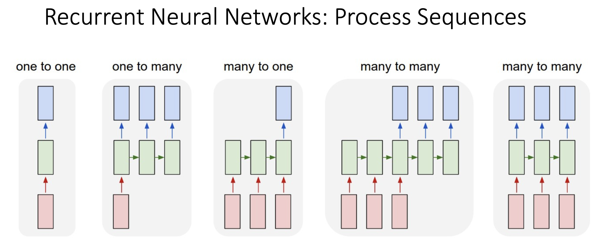
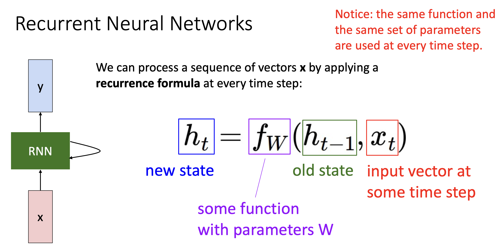
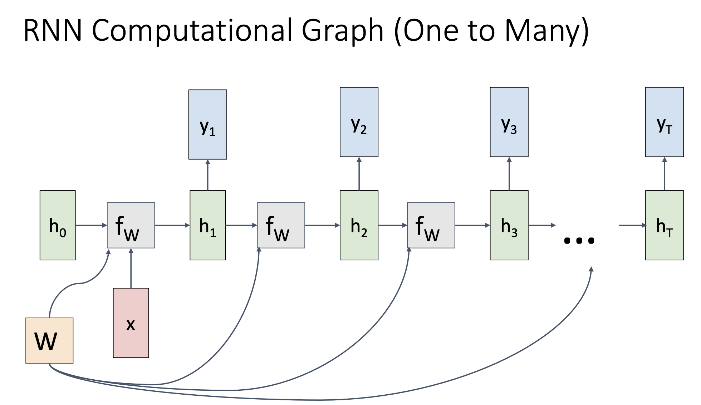
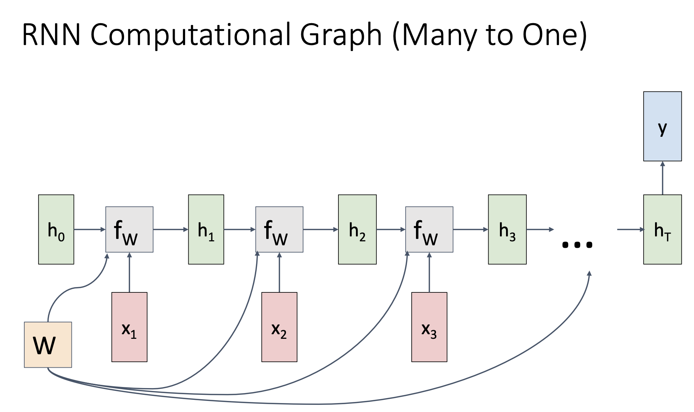
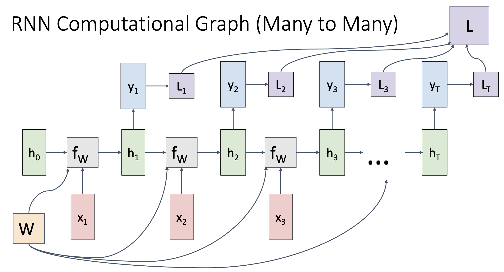
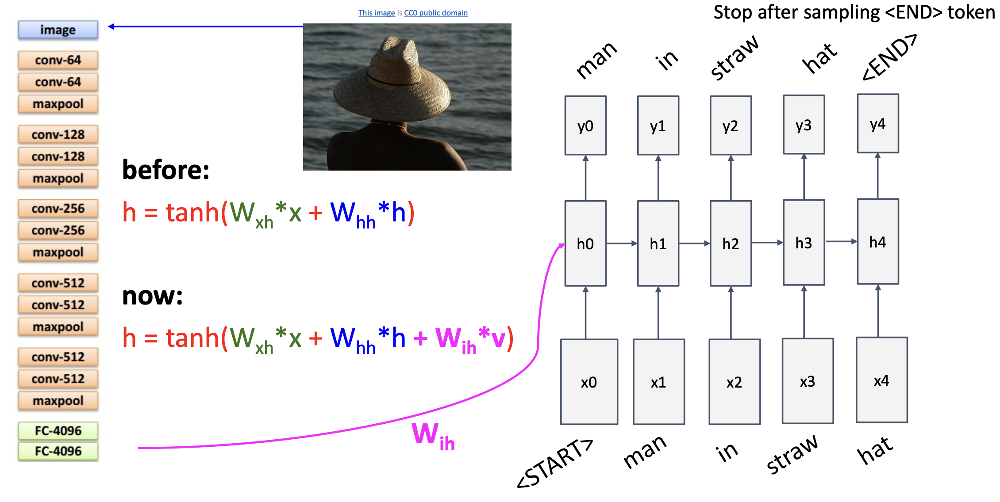
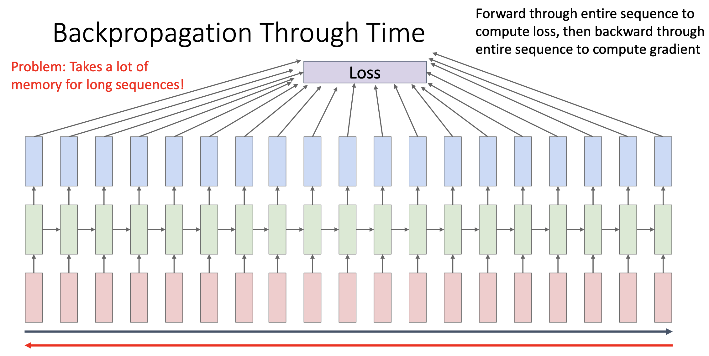
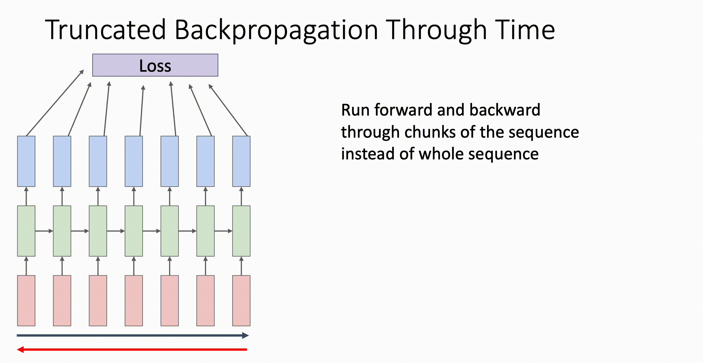
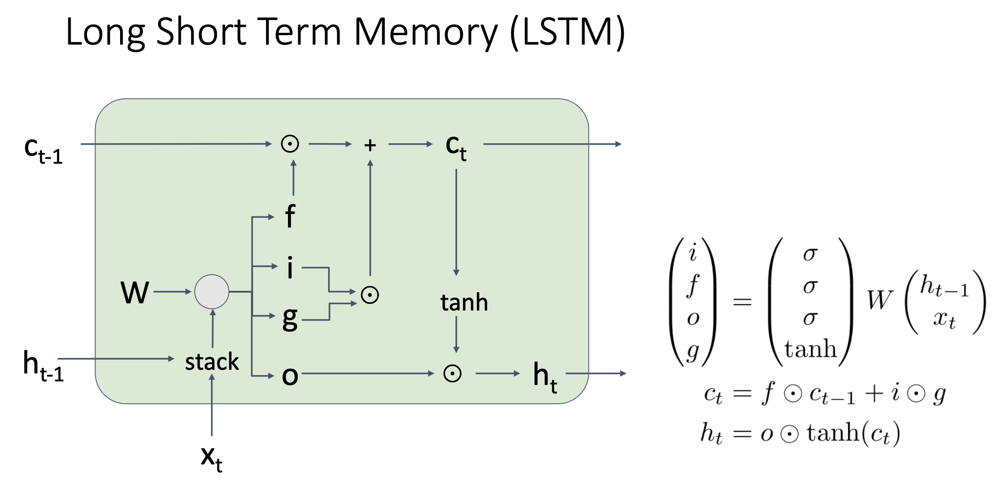

# Recurrent Neural Networks

## Intro

之前我们学习到的都属于前馈神经网络 (Feedforward Neural Networks) ，输入数据之间**没有时序先后关系**。当我们需要处理一些**有时序先后关系**的数据时，比如视频分类、语言模型、金融量化等等，就需要使用循环神经网络 (Recurrent Neural Networks, RNN) 。

> - 之前进行图像分类所用到的Linear Classifier, Fully-Connected Neural Networks, Convolutional Neural Networks等等都属于**one to one**的情况，一个图像对应一个标签
> - **one to many**的场景有Image Captioning (图像描述) ，输入一张图片，得到关于这个图片的文字描述 (**文字属于时序信息，因为一旦文字的先后顺序打乱，语义可能完全改变**)
> - **many to one**的场景有视频分类，视频可以看作一串有时序关系的图片，得到关于这一串图片的分类
> - **many to many**的场景有语言模型，输入一串文字，得到另一串文字

除了有时序先后关系的数据之外，RNN也能处理一些没有这种关系的数据，由于不是重点，所以不再赘述，可以参考以下文章：

- [Ba, Mnih, and Kavukcuoglu, “Multiple Object Recognition with Visual Attention”, ICLR 2015](https://arxiv.org/abs/1412.7755)
- [Gregor et al, “DRAW: A Recurrent Neural Network For Image Generation”, ICML 2015](https://arxiv.org/abs/1502.04623)
- [Ganin et al, “Synthesizing Programs for Images using Reinforced Adversarial Learning”, ICML 2018](https://proceedings.mlr.press/v80/ganin18a/ganin18a.pdf)

## Vanilla RNN

Vanilla RNN中有一个隐藏状态 $h_i$ 会随着序列数据的输入而不断更新，而下一个步骤的计算依赖于上一个步骤中的 $h_i$ , RNN就是这样处理时序数据的。 

假设有一个输入序列为: $[x_1, x_2, x_3]$ , 那么计算过程为：

1. 处理第一个输入信息: $h_1 = f(W_{xx} x_1 + W_{hh} h_0 + b)$
2. (Optional) 输出结果: $y_1 = W_{hy} h_1$
3. 处理第二个输入信息: $h_2 = f(W_{xx} x_2 + W_{hh} h_1 + b)$
4. (Optional) 输出结果: $y_2 = W_{hy} h_2$
5. 处理第三个输出信息: $h_3 = f(W_{xx} x_3 + W_{hh} h_2 + b)$
6. (Optional) 输出结果: $y_3 = W_{hy} h_3$

> $f$ 是激活函数, $h_0$ 通常被初始化为全零向量

另一种经典的结构是Sequence to Sequence (seq2seq) 模型，这是一个典型的Encoder-Decoder框架：

- Encoder (编码器)
  1. 处理输入数据 $[x_1, x_2, x_3, ...]$
  2. **整个输入序列的信息压缩如最后一个隐藏状态 $h_T$ 中**，该隐藏状态称为上下文向量 (Context Vector)

- Decoder (解码器)
  1. $h_T$ 作为解码器的初始隐藏向量
  2. **每一步的输入数据为上一步的输出 $y_i$** ，由于decoder中的第一步没有上一个输出 y，所以通常直接指定为 \<start\>或者\<s>

## Example: Image Captioning

Vanilla RNN用于Image Captioning的常见流程：

- 输入图像，经过多个卷积层
- 将图像平展，然后经过多个全连接层，最后输出向量v
- v和\<start>作为输入，进入循环层 (Recurrent Layer) 继续向前传播
- 当输出为\<end\>时停止向前传播，之前的所有输出组成对于图片的描述

## Backpropagation Through Time

RNN的反向传播被称为Backpropagation Through Time，时间上的反向传播。由于RNN的反向传播涉及时间先后关系，所以需要大量的内存来存储之前的数据。

更好的方法是Truncated Backpropagation Through Time，将整个传播过程分为不同的小块, **在小块内进行正向传播和反向传播，将更新好的隐藏状态作为下一个小块的初始隐藏状态** , 在下一个小块进行正向传播和反向传播，以此类推。

## LSTM

### Why LSTM

Vanilla RNN的缺点是，当层数一旦深起来，那么浅层的循环层容易出现梯度爆炸或者梯度消失的问题。当出现梯度爆炸时，难以训练；当出现梯度消失时，除了难以训练之外还会出现长期依赖难以学习的问题，也就说, **Vanilla RNN只能学习短期依赖，难以捕捉长时间间隔的信息**。

LSTM的解决方法是通过记忆单元 (Memory Cell) 和门控制 (Gate) 允许梯度更稳定地传播，进而解决长期依赖的问题。

### How LSTM Works

假设有输入数据 $[x_1, x_2, x_3]$ ，那么计算过程为：

1. 将 $x_1$ 向量和 $h_0$ 向量按照相同的维度拼接起来，一般将 $h$ 放在前面, $x$ 放在后面，表示为 $(h_{0} , x_1)^T$
2. $(h_{0} , x_1)^T$ 和权重矩阵W相乘后的结果分别进入不同的激活函数 (门控机制)
   - 遗忘门 $f$ 用 $sigmoid$ 计算，控制过去信息的保留
   - 输入门 $i$ ，用 $sigmoid$ 计算，控制新信息的流入
   - 输出门 $o$ ，用 $sigmoid$ 计算，控制最终输出多少信息
   - 候选门 $g$ ，用 $tanh$ 计算，用于提供新信息
3. $c_0$ 和 $f$ 相乘，然后和 $i$ 与 $g$ 相乘的结果相加，得到 $c_1$
4. $c_1$ 经过 $tanh$ 激活函数后和 $o$ 相乘，得到 $h_1$
5. $c_1, h_1$ 进入下一个LSTM Layer和输入数据 $x_1$ 进行相同的操作，以此类推

$c_i$ 是cell state，用于**储存长期信息**，使LSTM具有长期记忆; $h_i$ 负责**短期记忆**，并负责输出。

