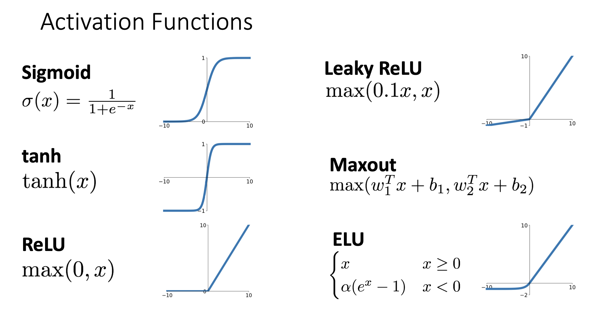
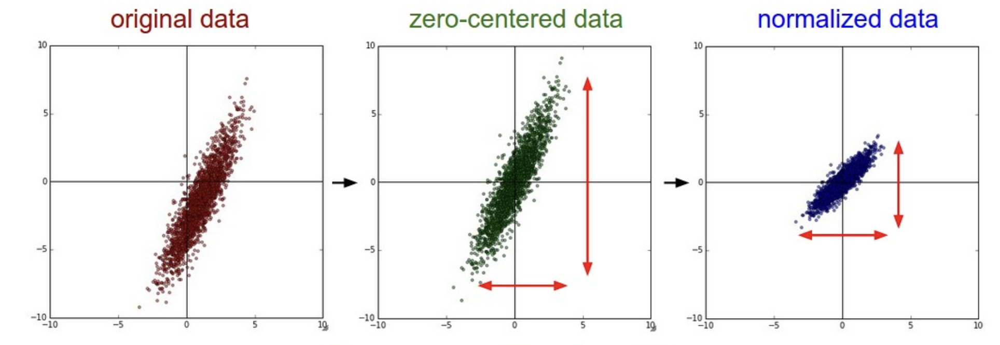

# Train Neural Networks

## 选择一个合适的激活函数

目前已经了解到激活函数有：



Sigmoid和tanh都不是很好的选择，因为在函数的两端曲线都非常平，梯度很小，导致在反向传播时很有可能出现**梯度消失**的问题。

ReLU也存在一个问题。如果被激活的矩阵中所有参数都小于0，那么激活之后所有参数都为0，那么进行反向传播时所有梯度都为0，这会导致无法进行更新，造成"死亡ReLU问题"  (Dead ReLU Problem) 。但是只要还有一个参数不为0，那么就能继续更新，还有可能将已经死亡的神经元重新激活。

Leaky ReLU就是为了防止出现Dead ReLU Problem而出现的，它不会出现所有神经元都为0的情况。

一般来说使用ReLU就可以了，如果需要进一步提升0.1%的效果 (其实效果没多大差别)，可以考虑Leaky ReLU / ELU / SELU / GELU等等。反正不要使用sigmoid或者tanh。

## 数据预处理

一般会将训练数据标准化，便于后续进行优化。



在其它某些情况中，可能会使用PCA或者Whitening的方法。


## 初始化参数

### Xavier Initialization

**当激活函数是对称的、以0为中心时，可以使用Xavier Initialization**。Xavier 初始化的目的是保持前向传播和反向传播过程中信号的方差稳定，防止梯度消失或爆炸。

- 对于全连接层：`W = torch.randn(Dimensions, Classes) / Dimensions`
- 对于卷积层：`W = torch.randn(Channels, Weights, Heights) / (Channels * KernelSize * KernelSize)`

### Kaiming / MSRA Initialization

对于像ReLU这样的激活函数，通常使用**Kaiming / MSRA Initialization**。

## Regularization

### Prevoius Methods

L1 regularization, L2 regularization...

### Dropout

Dropout的核心思想是：在训练的过程中随机丢弃一些神经元，使网络不会过度依赖于某些特定的神经元，提高模型的泛化能力。

在训练阶段，随机地将某些神经元设为0，将某个神经元设为 0的概率是超参数，通常为0.5。在测试阶段不会进行dropout操作，所有神经元都参与计算，并且乘上概率p。

````python
p = 0.5

def train():
  hidden_layer = X @ W1 + b1
  hidden_layer[hidden_layer < 0] = 0 # ReLU

  binary = (torch.rand(*hidden_layer) < p).to(hidden_layer.dtype)
  hidden_layer *= binary # drop!

	scores = hidden_layer @ W2 + b2
  
  loss = ...
  gradients = ...
  
def predict():
  hidden_layer = X @ W1 + b1
  hidden_layer[hidden_layer < 0] = 0 # ReLU
  hidden_layer *= p
  scores = hidden_layer @ W2 + b2

  y_pred = ...
````

### Data Augmentation

...