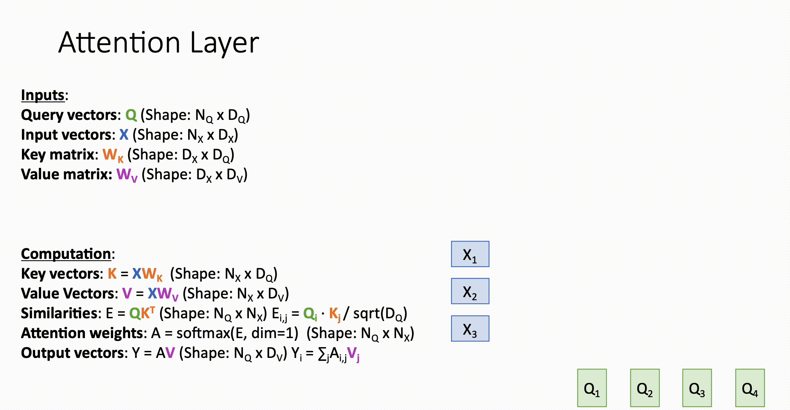
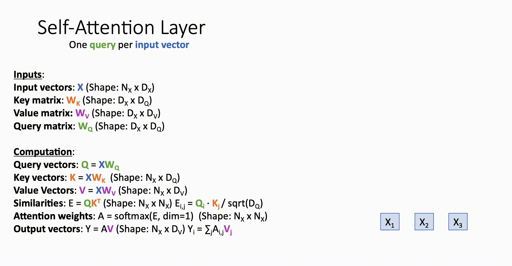
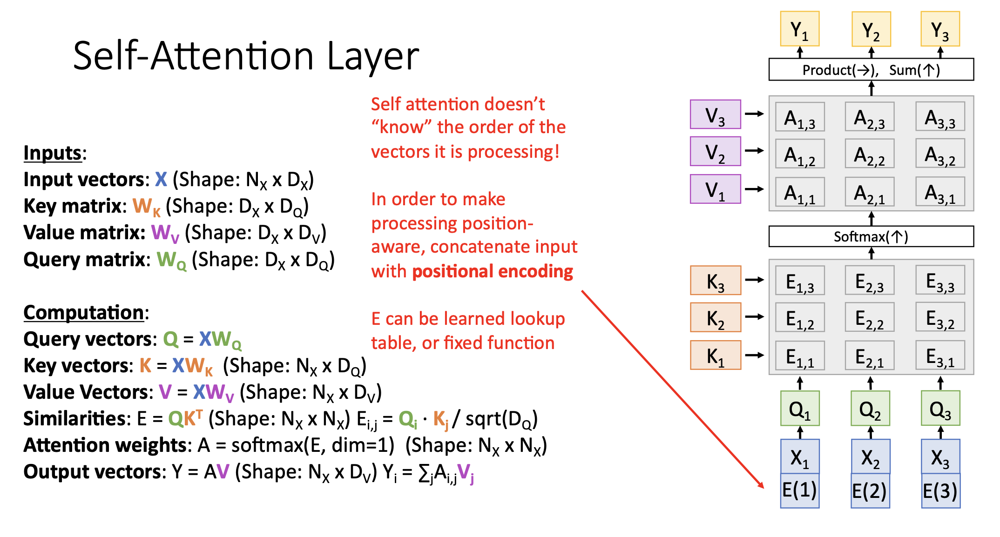
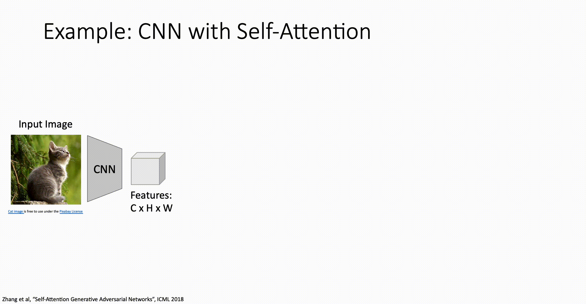
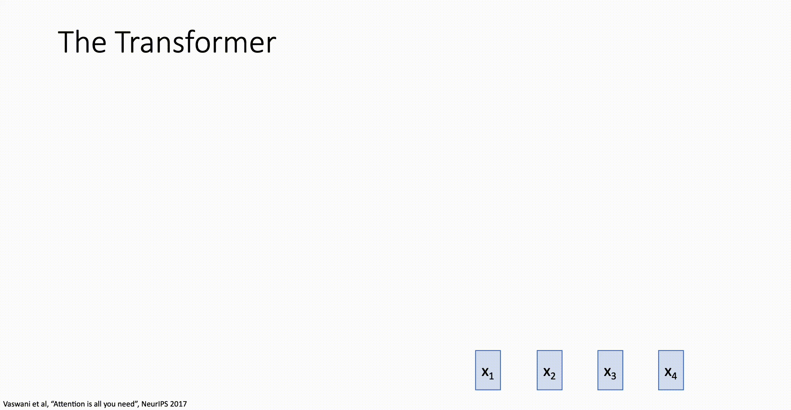

# Attention

## seq2seq with RNN and Attention

### seq2seq with RNN的不足

在之前讲到的[传统的 seq2seq with RNN 模型](013RecurrentNeuralNetworks.md#Vanilla-RNN)中，由于上下文向量 $h_T$ 的长度是固定的但是输入数据的个数却不是固定的，所以当输入的数据一旦多起来, **长度有限的上下文向量就不能有效捕捉整个输入序列的信息**。

除此之外，在之前还提到了 RNN 的另一个缺点：无法捕捉长期信息，只能捕捉短期信息。所以为了能够有效处理长段内容，我们提出了新的架构。

### How It Works

假设输入为四个单词 $x_1 = we, x_2 = are, x_3 = eating, x_4 = bread$ ，

那么输入数据会根据之前说的 Vanilla RNN 算法一步步向前传播：

1. $h_1 = f_{RNN}(x_1, h_0)$
2. $h_2 = f_{RNN}(x_2, h_1)$
3. $h_3 = f_{RNN}(x_3, h_2)$
4. $h_4 = f_{RNN}(x_4, h_3)$

$f_{RNN}$ 是之前说的[Vanilla RNN算法](013RecurrentNeuralNetworks.md#Vanilla-RNN)。

解码器的初始隐藏状态 $s_0$ 会初始化为 $h_4$ ，解码器中的隐藏状态 $s$ 会与编码器中的每个隐藏状态 $h$ 计算出一个 alignment sore：

1. $e_{11} = f_{alignemnt}(s_0, h_1)$

2. $e_{12} = f_{alignemnt}(s_0, h_2)$
3. $e_{13} = f_{alignemnt}(s_0, h_3)$
4. $e_{14} = f_{alignemnt}(s_0, h_4)$

$f_{alignment}$ 是某种前馈神经网络，比如一层或两层的全连接网络。

随后 alignment scores 会被 softmax 归一化为 Attention 权重：

1. $a_{11} = softmax(e_{11})$
2. $a_{12} = softmax(e_{12})$
3. $a_{13} = softmax(e_{13})$
4. $a_{14} = softmax(e_{14})$

$a$ 表示了解码器在当前时间步对于各个 $x$ 的关注程度。

然后将 $a$ 与 $h$ 相乘然后再求和得到 $c_1$ ，即第一个上下文向量：

$c_1 = a_{11} \times h_1 + a_{12} \times h_2 + a_{13} \times h_3 + a_{14} \times h_4$

$c_1$ 会和第0个输出 \<start\> (编码后) 进行计算得到 $s_1$，即下一个隐藏状态：

$s_1 = f_{RNN}(y_0, c_1)$

然后 $s_1$ 会像 $s_0$ 一样和编码器中的隐藏状态 $h$ 进行计算得到 $e$ ，然后再 $softmax$ 得到 $a$ , $a$ 再和 $h$ 相乘求和得到下一个上下文向量 $c_2$ ，如此循环知道输出结束符 \<stop\> 。

### Example: Image Captioning

一张图片经过多个卷积层后仍是一个三维张量，可以将这个三维张量中每一个高宽位置上的向量看作编码器的隐藏向量 $h$ 。

1. 解码器的初始隐藏向量 $s_0$ 分别与 $h$ 进行 前馈神经网络传播得到 $e$ ，然后 $e$ 再进行归一化为 $a$ , $a$ 再与 $h$ 相乘然后求和得到第一个上下文向量 $c_1$ 。

2. $c_1$ 与 $y_0$ \<start\> 进行 Vanilla RNN 传播得到 $s_1$ 并输出 $y_1$ 。

3. $s_1$ 重复 $s_0$ 的步骤，如此重复，直到输出 \<stop\> 。

## Attention Layer

$X$ 为输入矩阵，每一行是单独的输入样本，与 $W_k, W_V$ 相乘分别得到键矩阵 $K$ 和 值矩阵 $V$ 。

键矩阵 $K$ 和查询矩阵 $Q$ 相乘，用于判断 Query 和 Key 之间的匹配程度，当 $E_{ij}$ 越大，表明 $Q_i$ 查询和 $K_j$ 索引的相似度越高，表明 $K_j$ 可能是 $Q_i$ 查询想要的内容。

随后 $E$ 按照每一行进行 softmax 归一化，得到 $A$ ，称为注意力分数。

用注意力分数 $A$ 和值矩阵 $V$ 相乘，得到最终的输出 $Y$ 。

> 注意：
>
> - $E$ 会除以一个系数 (通常是 $\sqrt{D_Q}$) 防止softmax之后溢出

## Self-Attention Layer

$X$ 依旧是输入矩阵，每一行是单独的输入样本，与 $W_Q, W_K, W_V$ 相乘分别得到查询矩阵 $Q$ 、键矩阵 $K$ 、值矩阵 $V$ 。

和 Attention Layer 一样, $Q$ 和 $K$ 相乘得到 alignment scores $E$ ，然后再 softmax 归一化得到注意力分数 $A$ ，再与 $V$ 相乘得到最终的输出 $Y$ 。

> 注意：
>
> - $Q, K$ 形状相同, $D_Q$ 是超参数
> - $E$ 会除以一个系数 (通常是 $\sqrt{D_Q}$) 防止softmax之后溢出

Self-Attention Layer 和普通的 Attention Layer 的区别在于：

- $Q$ 的来源不一样。普通 Attention Layer 中的 $Q$ 来自于 Decoder 中的隐藏状态 $S$ ，Self-Attention Layer 中的 $Q$ 来自于输入 $X$ 和 $W_Q$ 的乘积。
- 由于 $Q$ 的来源不同，所以 Attention Layer 能够关注到输入的时序关系，而 **Self-Attention Layer 不能关注到输入的时序关系**。

普通的 Attention Layer 还是基于 seq2seq 架构的，但是 Self-Attention Layer 完全是另一种架构了，它是 Tranformer 的核心。由于 Self-Attention Layer 不能关注到输入的时序关系，所以常常会给输入 $X$ 进行**位置编码** (Positional Encoding) 。

### Example: Image Captioning

## The Transformer

Transformer Block：

1. 输入矩阵 $[x_1, x_2, x_3, x_4]$ 经过Self-Attention Layer得到的输出 $[x_1', x_2', x_3', x_4']$ 

2. $[x_1', x_2', x_3', x_4']$ 和 $[x_1, x_2, x_3, x_4]$ 相加得到 $[x_1'', x_2'', x_3'', x_4'']$ (Residual Connection)

3. $[x_1'', x_2'', x_3'', x_4'']$ 进行层归一化得到 $[x_1''', x_2''', x_3''', x_4''']$ ，然后分别送入不同的 Fully-Connected Layers 得到向量 $x_1'''', x_2'''', x_3'''', x_4''''$

4. $x_1'''', x_2'''', x_3'''', x_4''''$ 相加然后再和 $[x_1''', x_2''', x_3''', x_4''']$ 相加 (广播机制) 然后再进行一次层归一化，得到输出 $[y_1, y_2, y_3, y_4]$

一个 Tranformer 模型由多个 Transformer Block 组成，与传统的 Vanilla RNN, LSTM 不同，Tranformer 不需要按照顺序处理序列中的每个元素，它可以直接并行计算，大大提高了训练效率。由于没有传统 RNN 中的递归结构，Transformer 可以灵活地处理不同长度的序列，并且不会受到序列长度的限制。

