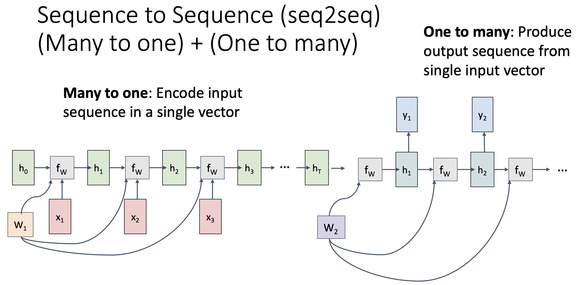
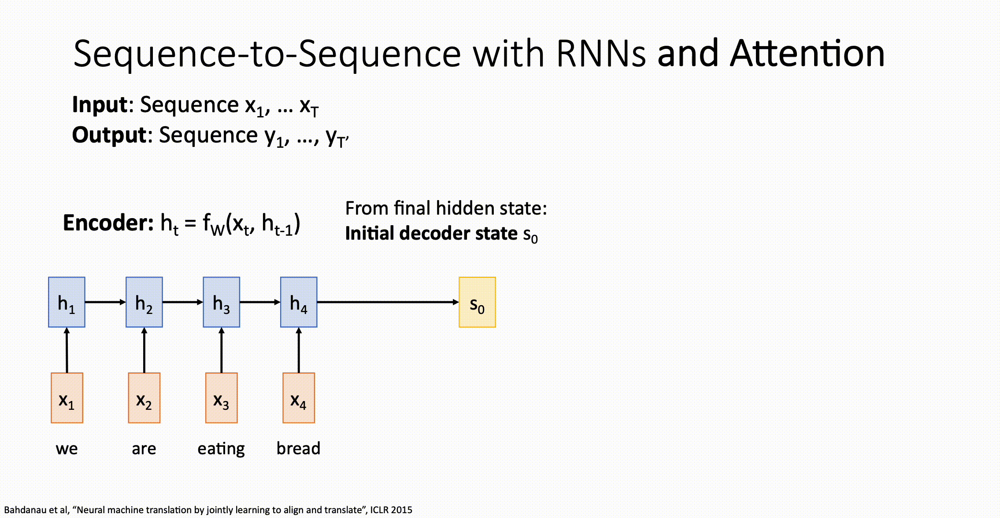
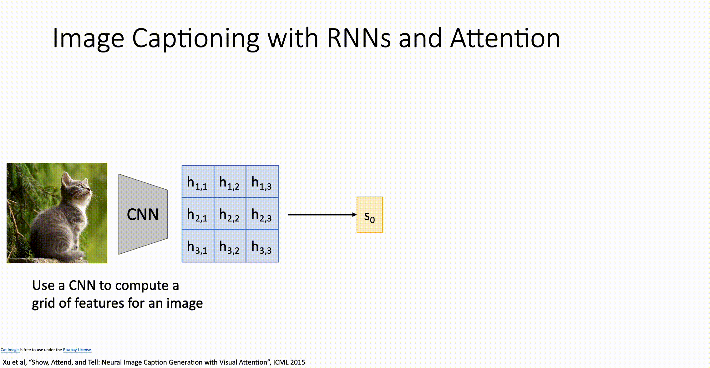

# Attention

## seq2seq with RNN and Attention

### seq2seq with RNN的不足

在之前讲到的[传统的seq2seq with RNN模型](013RecurrentNeuralNetworks.md#Vanilla-RNN)中，由于上下文向量 $h_T$ 的长度是固定的但是输入数据的个数却不是固定的，所以当输入的数据一旦多起来, **长度有限的上下文向量就不能有效捕捉整个输入序列的信息**。

除此之外，在之前还提到了RNN的另一个缺点：无法捕捉长期信息，只能捕捉短期信息。所以为了能够有效处理长段内容，我们提出了新的架构。

### How It Works

假设输入为四个单词 $x_1 = we, x_2 = are, x_3 = eating, x_4 = bread$ ，

那么输入数据会根据之前说的Vanilla RNN算法一步步向前传播：

1. $h_1 = f_{RNN}(x_1, h_0)$
2. $h_2 = f_{RNN}(x_2, h_1)$
3. $h_3 = f_{RNN}(x_3, h_2)$
4. $h_4 = f_{RNN}(x_4, h_3)$

$f_{RNN}$ 是之前说的[Vanilla RNN算法](013RecurrentNeuralNetworks.md#Vanilla-RNN)。

解码器的初始隐藏状态 $s_0$ 会初始化为 $h_4$ ，解码器中的隐藏状态 $s$ 会与编码器中的每个隐藏状态 $h$ 计算出一个alignment sore：

1. $e_{11} = f_{alignemnt}(s_0, h_1)$

2. $e_{12} = f_{alignemnt}(s_0, h_2)$
3. $e_{13} = f_{alignemnt}(s_0, h_3)$
4. $e_{14} = f_{alignemnt}(s_0, h_4)$

$f_{alignment}$ 是某种前馈神经网络，比如一层或两层的全连接网络。

随后alignment scores会被softmax归一化为Attention权重：

1. $a_{11} = softmax(e_{11})$
2. $a_{12} = softmax(e_{12})$
3. $a_{13} = softmax(e_{13})$
4. $a_{14} = softmax(e_{14})$

$a$ 表示了解码器在当前时间步对于各个 $x$ 的关注程度。

然后将 $a$ 与 $h$ 相乘然后再求和得到 $c_1$ ，即第一个上下文向量：

$c_1 = a_{11} \times h_1 + a_{12} \times h_2 + a_{13} \times h_3 + a_{14} \times h_4$

$c_1$ 会和第0个输出 \<start\> (编码后) 进行计算得到 $s_1$，即下一个隐藏状态：

$s_1 = f_{RNN}(y_0, c_1)$

然后 $s_1$ 会像 $s_0$ 一样和编码器中的隐藏状态 $h$ 进行计算得到 $e$ ，然后再 $softmax$ 得到 $a$ , $a$ 再和 $h$ 相乘求和得到下一个上下文向量 $c_2$ ，如此循环知道输出结束符 \<stop\> 。

## Example: Image Captioning

一张图片经过多个卷积层后仍是一个三维张量，可以将这个三维张量中每一个高宽位置上的向量看作编码器的隐藏向量 $h$ 。

1. 解码器的初始隐藏向量 $s_0$ 分别与 $h$ 进行 前馈神经网络传播得到 $e$ ，然后 $e$ 再进行归一化为 $a$ , $a$ 再与 $h$ 相乘然后求和得到第一个上下文向量 $c_1$ 。

2. $c_1$ 与 $y_0$ \<start\> 进行 Vanilla RNN 传播得到 $s_1$ 并输出 $y_1$ 。

3. $s_1$ 重复 $s_0$ 的步骤，如此重复，直到输出 \<stop\> 。

