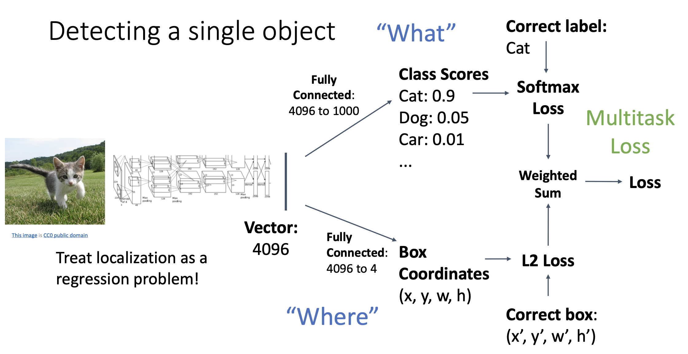
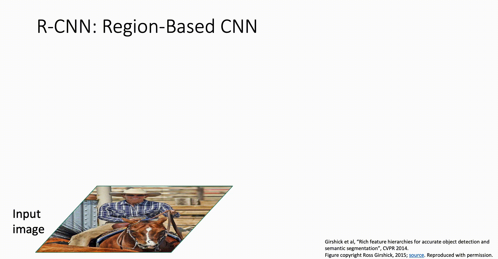
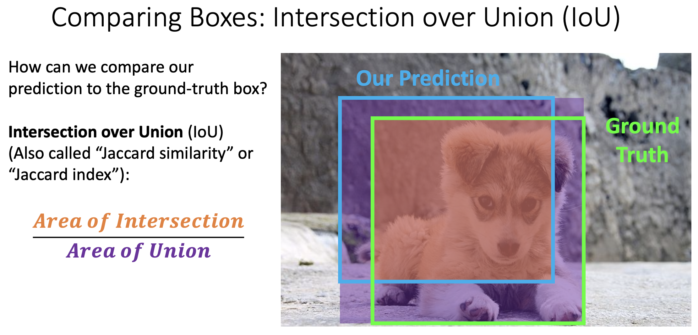
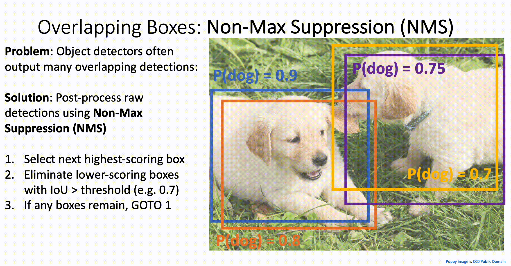
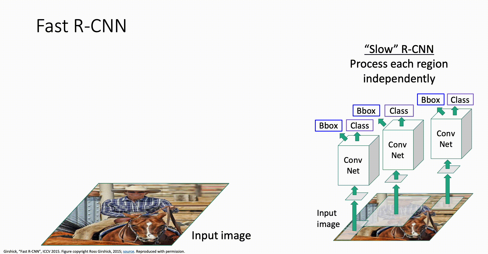
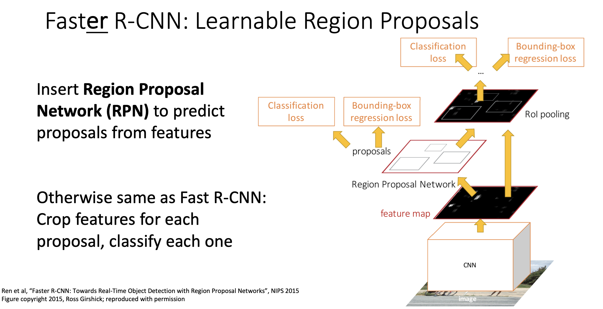

# Object Detection

## Task Definition

对于物体检测任务来说，输入是一个 RGB 图片，输出是一系列被识别到的物体，每个物体由如下内容：

- Category label: from a fixed set of categories
- Bounding box: four numbers composed of x, y, height and width

物体检测任务，相对于一般的图像分类任务所用到的图片尺寸 3\*224\*224 ，通常需要更大维度的图片，通常是 3\*800\*600 。

### Detecting a Single Object

检测图片中的单个物体比较简单和直观，将一个图片经过卷积神经网络 (通常是已经预训练好的) 后分别送入两个全连接层，一个全连接层负责识别这个物体是什么 (what) ，另一个全连接层负责识别这个物体的位置 (where) ，然后分别得到关于这两个任务的 loss ，最后再将这两个 loss 通过一定的权重加起来。

### Detecting Multiple Objects (R-CNN)

对于多物体的检测，通常的训练流程如下：

- 使用 Region Proposals 方法，在图片中确定可能包含所有需要检测物体的小区域 (Regions of Interest, RoI)
- 将各个小区域中的图片大小全部转换为统一的大小 (比如 224*224) ，统一接口方便传入 CNN 
- 然后分别对这些小区域使用[单个物体检测的方法](#Detecting-a-Single-Object)，得到物体的类别的区域

- 最后对得到的物体区域 (x, y, height, width) 进行转换，得到最终的物体区域

> 由 Region Proposals 得到的小区域太''硬''了，所以我们在最后一步加上了可学习参数对这些位置进行一些调整。

#### Comparing Boxes: Intersection over Union

一张图片经过正向传播得到不同物体的区域后，我们使用 Intersection over Union 和标签中的区域进行比较。

- $IoU > 0.5$: decent
- $IoU > 0.7$: pretty good
- $IoU > 0.9$: almost perfect

#### Avoid Overlapping: Non-Max Supression

由于在 Region Proposals 阶段会产出大量的 RoI，所以这些 RoI 有很多都会相互重叠，在同一个物体上输出很多次检测结果。解决这个问题的办法是使用 Non-Max Supression:

- 选出下一个得分最高的区域，计算该区域和其它区域的 IoU。如果 IoU 大于某个阈值 (比如 0.7) ，那么可以认为这些区域是对同一个物体的检测，将这些区域去掉。

> 关于下一个得分最高的区域：如果是第一次进行 Non-Max Supression，则是所有区域中得分最高的区域；如果是第二次进行 Non-Max Supression，则是除掉上一个得分最高的区域外，其余区域得分最高的区域，以此类推。

- 重复以上过程，直到区域的个数没有再变化。

#### Evaluating Object Detection: Mean Average Precision

没懂这一块...

## Fast R-CNN

在之前提到的 [R-CNN](#Detecting-Multiple-Objects-R-CNN) 架构中，2000多个 RoI 会经过大型卷积神经网络，这使得运行速度很慢。Fast R-CNN 进行如下调整，使得运算速度大大加快：

- 先将整个图片经过大型卷积神经网络，只经过其中的卷积层，不经过平展和全连接层
- 对得到的特征图使用 Region Proposals 得到 RoI，然后全部转换为统一的大小，传入更轻量级的 CNN 中得到物体的类别和位置，最终使用 Non-Max Supression 去掉重复的结果

## Faster R-CNN

Faster R-CNN 的结构大部分和 Fast R-CNN 相似，唯一的不同之处在于 RoI 的选取。在之前的模型中，RoI 的选取依赖于 Region Proposals 方法；而在 Faster R-CNN 中，RoI 的选取是根据 Region Proposal Network 的，这是一个可学习的神经网络。Faster R-CNN 的具体流程如下：

- 先将整个图片经过大型卷积神经网络，只经过其中的卷积层，不经过平展和全连接层
- 将得到的特征图送入 Region Proposal Network。Anchor 可以看作一个框，判断这个框内有没有物体
- 将经过 RPN 的特征图分别送入两个并行分支：
  1. 分类分支：判断该 Anchor 内是物体还是背景
  2. 回归分支：若 Anchor 内是物体，则像传统 Region Proposals 的方式一样，使用可学习参数对卷积核的大小进行调整，得到精确的边框界限
- 将得到的候选框经过 Non-Max Supression 去掉重复的结果，然后全部转换为统一的大小，传入更轻量级的 CNN 中得到物体的类别和位置
- 最终再次进行一次 Non-Max Suppression 去掉重复的结果

