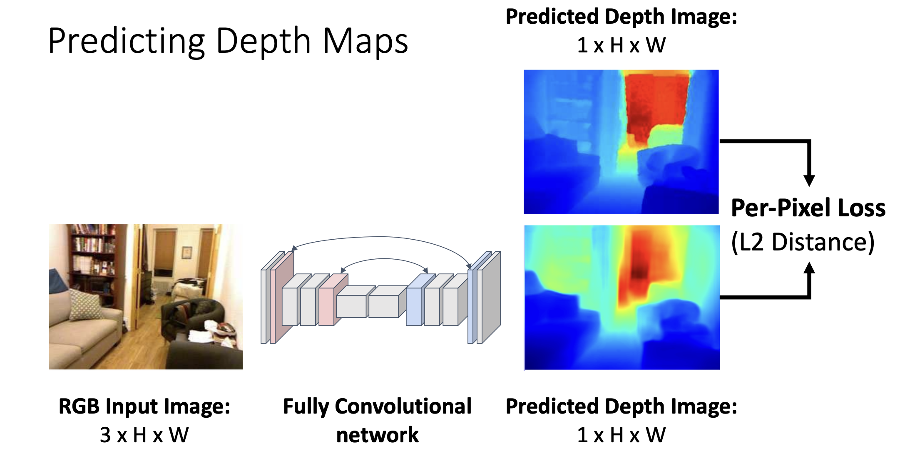
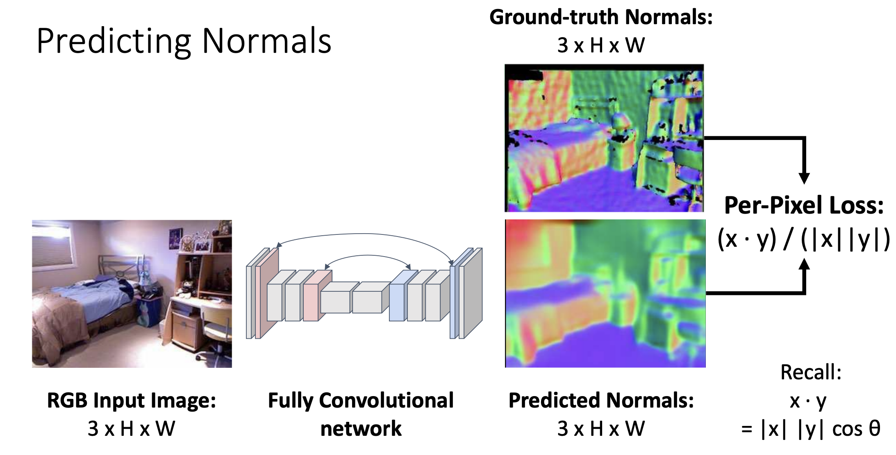
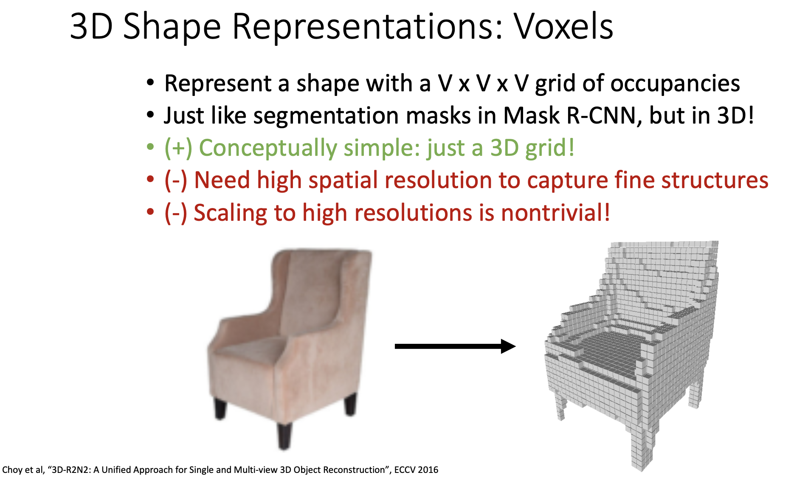
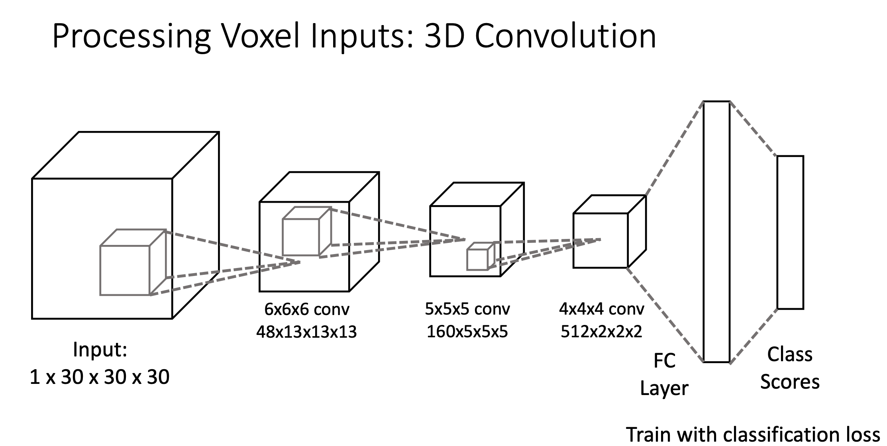
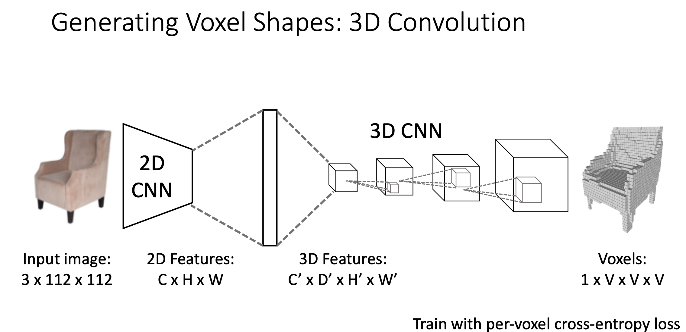
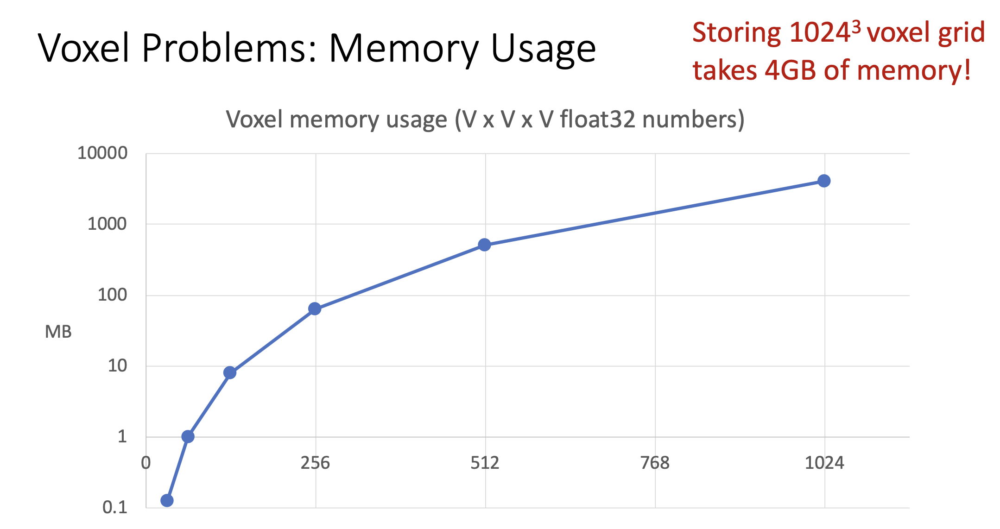

# 3D Vision

## 常见方法

### Depth Map

对于一个图像中的每个像素，depth map 给出从相机镜头到物体中这个像素的距离。Depth Map 又称作 RGB-D Image (RGB Image + Depth Image)。

Depth Image 的训练方法很简单，通过多个卷积层 (不通过全连接层) ，最终得到高度和宽度不变、通道数为1的特征图，然后和标签比较进行优化。

### Surface Normals

对于图片中每个像素，surface normals 方法给出一个关于那个像素的法向量 (normal vector) ，这个法向量通常是3维的，便于展示 RGB 图片。

Surface Normals 的训练方法也很简单，同样经过多个卷积层 (不经过全连接层) ，然后得到和原图片相同形状的特征图，根据标签进行优化。

> 可以看到如下图片中，朝向同一个方向的平面的颜色是相同的。

### Voxel Grid

Voxel Grid 使用多个 $V \times V \times V$ 大小的立体格子来表示一个物体的 3D 形状。

用一个四维矩阵来表示 Voxel Input ，可以通过以下方法对一个 Voxel Input 进行分类：

可以通过如下方法将图片转化为 Voxel：

Voxel Grid 的缺点是计算开销非常大。

