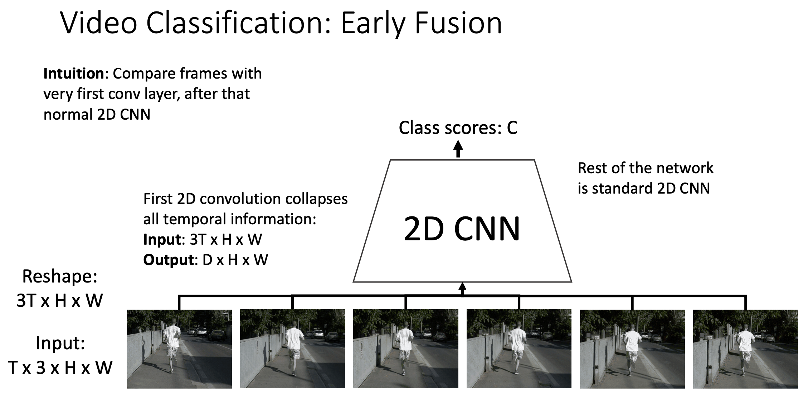

# Video

## Normal Approaches

### Single-Frame CNN

Single-Frame CNN 的想法非常简单粗暴，将视频中的每个图片分别送入普通的二维 CNN 模型中，得到关于这个图片的分类分数。然后在由视频中的图片构成的图片集中取平均值，得到最大的平均值，最大平均值分数对应的标签就是分类的结果。

### Late Fusion

Late Fusion 在 Single-Frame CNN 基础上增加了一步，在 CNN 之后将所有的图片平展

为一个统一的向量，然后传入全连接层。

Late Fusion 有一个问题，不同的图片经过不同的 CNN 之后, **难以捕捉不同帧中初级特征的变化** (经过 CNN 后图片相当于被破坏了，初级特征丢失) 。

### Early Fusion

Early Fusion 在某种程度上可以解决 Late Fusion 无法捕捉不同帧中初级特征的变化的问题，它将视频的形状 $T \times C \times H \times W$ 变为 $T * C \times H \times W$ ，然后统一送入 CNN 之中。

Early Fusion 也有不足之处，在将视频的形状进行 reshape 时其实破坏了视频的时序信息。

### 3D CNN

我们拥有的视频形状是 $T \times C \times H \times W$ ，三维卷积核的形状是 $T' \times C \times H' \times W'$ 。在二维卷积中，卷积核只会沿着 H 与 W 的方向进行滑动；而在三维卷积中，卷积核会沿着 T, H, W 三个方向进行滑动，得到卷积的结果。和二维卷积类似的是, **三维卷积核的通道数必须与输入的通道数保持一致**，可以有多个卷积核, **卷积核的个数就是输出特征图的通道数**。3D CNN 的缺点是对于计算的开销过大，浮点数运算是 2D CNN 的3倍左右。

### Performance

在以上讲到的模型中，Single-Frame CNN 的表现实际上是很好的，鉴于它很简单也很直观。所以在进行视频分类时，可以优先使用 Single-Frame CNN。

## Two-Stream Networks

人类其实只用根据物体移动的信息就能辨别出动作，所以 Two-Stream Networks 使用了一种名叫 Optical Flow 的方法来判断**两个相邻图片中前一个图片里每个像素点的移动方向**。

输入的视频会分别送入两个 CNN 中，第一个 CNN 是普通的 Single-Frame CNN，第二个 CNN 是使用了 Optical Flow 方法得到的像素点移动方向组成的 CNN。这两个 CNN 会分别得到一个分数，对这两个分数进行求均值就得到了最终的分类结果。

使用这种方法得到的准确率会比[一般方法](#Normal-Approaches)的准确率更高，计算开销相对还没有那么大。

## Self-Attention + 3D CNN

可以使用 Self-Attention 的方式来处理视频中的时序信息，使用 3D CNN 来处理视频中的空间信息。

