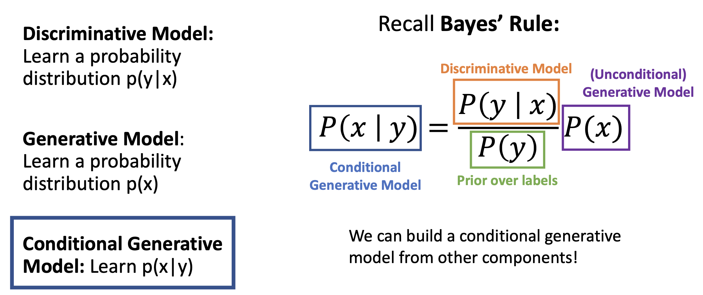
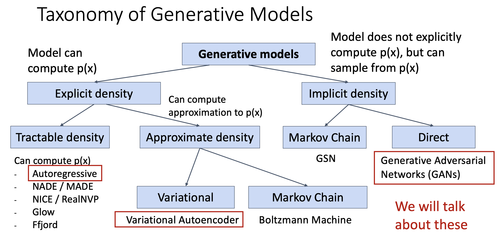
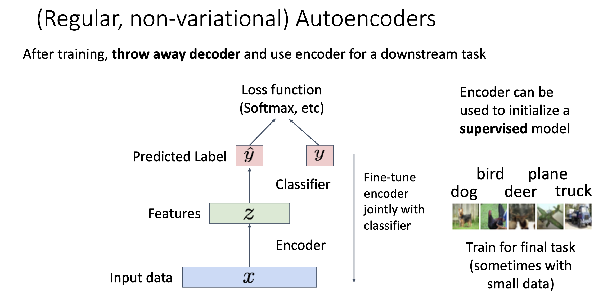
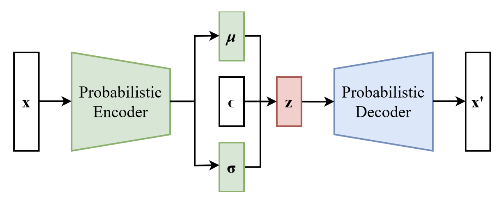

# Generative Models

## Supervised vs Unsupervised Learning

监督学习本质上可以看作这样一个过程：需要训练的模型是 $f$，数据是 $(x, y)$，其中 $x$ 是输入数据 $y$ 是标签，通过梯度下降的方式达到 $f: x \rightarrow y$。之前学到的内容 (分类、回归、物体检测、图像描述等等) 都是属于监督学习。

而无监督学习就只有输入 $x$，没有标签 $y$，它的目标是学习到 $x$ 中的隐藏结构。一些无监督学习的例子有 K-Means Clustering, Principle Component Analysis, Autoencoder, Density Estimation 等等。

## Discriminative vs Generative Models

Discriminative Model 是在有限的标签 $y$ 中寻找最符合输入 $x$ 的过程。它的问题在于不能处理不合理的输入，所有标签的概率和为 1，总会有概率最大的标签出现，即便这个标签是错的。比如在一个只有猫、狗两个标签的模型中输入一个猴子，这个模型输出的标签无论怎样都不是猴子，它的输出只能是猫或者狗。

Generative Model 的目标是学习关于输入 $x$ 本身的概率分布，而不受到标签 $y$ 的影响。它是在整个关于输入 $x$ 的分布中进行学习，也就是说，它可以拒绝不合理的输入。

Conditional Generative Model 结合了 Discriminative Model 和 Generative Model，它学习的给定标签 $y$，应该得到怎样的输入 $x$。

Discriminative Model 可以看作是 $P(y|x)$，Generative Model 可以看作是 $P(x)$，Conditional Generative Model 可以看作是 $P(x|y)$，那么根据贝叶斯公式就可以得到 $P(x|y) = \frac{P(y|x)}{P(y)} P(x)$。也就是说，一个 Discriminative Model 可以通过某种转换得到 Conditional Generative Model。

这是一个关于 Generative Model 的分类，后面将会讲到 Autoregressive Model, Variational Autoencoder 和 Generative Adversarial Networks。

## Autoregressive Models

Autoregressive Model 是一种能显示表达概率的并且能追踪概率的模型，它可以表示为 $P(x) = f(x, W)$ ，训练自回归模型就是训练 $W$， $W^* = argmax_W \sum_i logP(x^{(i)}) = argmax_W \sum_i logf(x^{(i)}, W)$，找到使输入数据概率最大的 $W^*$。

$x$ 是多个输入的集合 $x = (x_1, x_2, ..., x_T)$，那么 $P(x) = P(x1, x_2, ..., x_T) = P(x_1)P(x_2|x_1)P(x_3|x_1x_2)...$。可以发现这种形式和之前学习到的 RNN 很相似，每一个 $x_t$ 都依赖于之前所有的 $x$。事实上，Autoregressive Model 就是一种基于序列的统计模型，它通过过去的值来预测当前或者未来的值，RNN, LSTM, Transformer 都是自回归模型不同的实现方式。

## Variational Autoencoder

### (Normal) Autoencoder

Autoencoder 使用一个 Encoder 和 Decoder 分别将输入 $x$ 转换为低维度的潜在表示 $z$ 再将低维度特征 $z$ 转换为重构后的 $x$ 记作 $\hat x$。通过使损失函数 $loss = \sum_i ||\hat x_i - x_i||^2$ 最小，Autoencoder 重构了输入 $x$ 并保留了它的低维信息。

> Encoder, Decoder 都是深度神经网络，Encoder 用于降低输入 $x$ 的尺寸 (维度) 得到 $z$，Decoder 用于将低维度的潜在表示 $z$ 复原为 $x$ 的维度。经过 Autoencoder 得到的 $\hat x$ 和原来的 $x$ 相比会更加模糊。

在训练结束后，Autoencoder 会丢掉 Decoder，因为训练的目标是学习输入 $x$ 的编码过程 (即调整 Encoder)，关注如何有效地压缩输入数据，而不一定是要将压缩后的数据恢复。

### Variational Autoencoder

在普通的 Autoencoder 中, $z$ 是一个确定的映射，这意味着对于每个输入 $x$，模型会输出一个单一的 $z$，这种方式无法表达潜在空间中的不确定性。Variational Autoencoder 不会输出一个确定的潜在表示，而是通过 Probabilistic Encoder 输出关于潜在表示的均值 $\mu$ 和标准差 $\sigma$，随后它会从正态分布中引入一个随机噪声 $\epsilon$ 来得到潜在表示 $z = \mu + \sigma \cdot \epsilon$。潜在表示 $z$ 随后被送入 Probabilistic Decoder 重建 $\hat x$ 并输出关于 $\hat x$ 的均值 $\mu$ 和标准差 $\sigma$。

> Probabilistic Encoder 和 Probabilistic Decoder 都是深度神经网络，它们和一般的 Encoder, Decoder 的区别在于它们输出的不是直接的潜在表示，而是关于潜在表示的均值 $\mu$ 和方差 $\sigma$。

VAE 的损失函数由两部分构成，Reconstruction Loss 和 KL Divergence Loss：

- Reconstruction Loss: 由于 Probabilistic Decoder 输出的也是均值 $\hat\mu$ 和误差 $\hat \sigma$，可以通过 $\hat x = \hat \mu + \hat \sigma \cdot \hat \epsilon$ 得到 $\hat x$ ($\hat \epsilon$ 来自正态分布)，进而得到 Reconstruction Loss $loss_{recon} = ||x - \hat x||^2$
- KL Divergence Loss: $loss_{KL} = \frac{1}{2} \sum i(1 + log \sigma_i^2 - \mu_i^2 - \sigma_i^2)$，用于保证潜在空间的结构合理，保障 VAE 的生成能力

最终的损失函数: $loss_{VAE} = loss_{recon} + \beta loss_{KL}$, $\beta$ 用于调节两者之间的权重。

关于 VAE 详细的数学推导可以参考[维基百科](https://en.wikipedia.org/wiki/Variational_autoencoder)。

## Generative Adversarial Networks

Coming Soon...