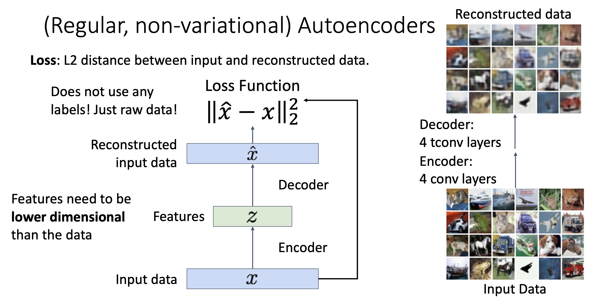
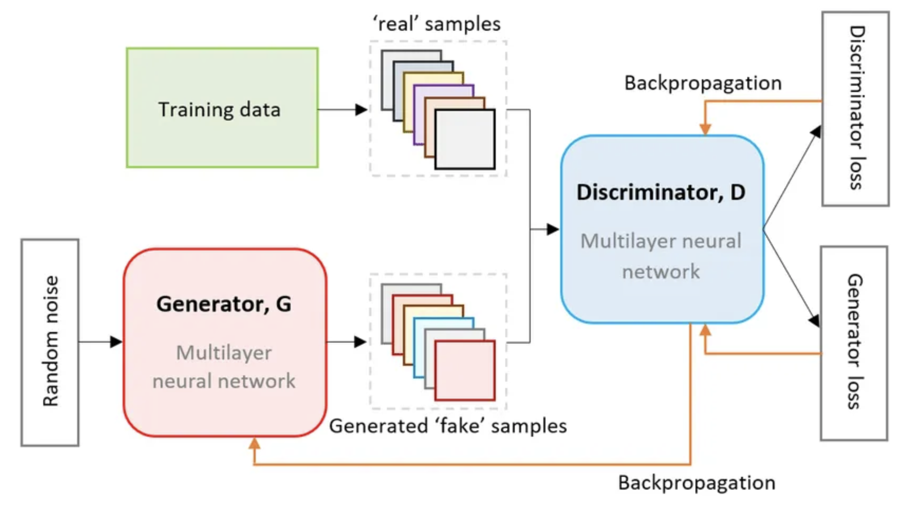

# Generative Models

## Supervised vs Unsupervised Learning

监督学习本质上可以看作这样一个过程：需要训练的模型是 $f$，数据是 $(x, y)$，其中 $x$ 是输入数据 $y$ 是标签，通过梯度下降的方式达到 $f: x \rightarrow y$。之前学到的内容 (分类、回归、物体检测、图像描述等等) 都是属于监督学习。

而无监督学习就只有输入 $x$，没有标签 $y$，它的目标是学习到 $x$ 中的隐藏结构。一些无监督学习的例子有 K-Means Clustering, Principle Component Analysis, Autoencoder, Density Estimation 等等。

## Discriminative vs Generative Models

Discriminative Model 是在有限的标签 $y$ 中寻找最符合输入 $x$ 的过程。它的问题在于不能处理不合理的输入，所有标签的概率和为 1，这会在标签之间引入某种竞争导致总会有概率最大的标签出现，即便这个标签是错的。比如在一个只有猫、狗两个标签的模型中输入一个猴子，这个模型输出的标签无论怎样都不是猴子，它的输出只能是猫或者狗。

Generative Model 的目标是学习关于输入 $x$ 本身的概率分布，而不受到标签 $y$ 的影响。它是在整个关于输入 $x$ 的分布中进行学习，也就是说，它可以拒绝不合理的输入。

Conditional Generative Model 结合了 Discriminative Model 和 Generative Model，它学习的给定标签 $y$，应该得到怎样的输入 $x$。

Discriminative Model 可以看作是 $P(y|x)$，Generative Model 可以看作是 $P(x)$，Conditional Generative Model 可以看作是 $P(x|y)$，那么根据贝叶斯公式就可以得到 $P(x|y) = \frac{P(y|x)}{P(y)} P(x)$。也就是说，一个 Discriminative Model 可以通过某种转换得到 Conditional Generative Model。

更通俗的来说，Discriminative Model 是判别模型，用于**判断数据之间的区别**；Generative Model 是生成模型，主要用于学习数据的分布并**生成新的类似的数据**。

这是一个关于 Generative Model 的分类，后面将会讲到 Autoregressive Model, Variational Autoencoder 和 Generative Adversarial Networks。

## Autoregressive Models

Autoregressive Model 是一种能显示表达概率的并且能追踪概率的模型，它可以表示为 $P(x) = f(x, W)$ ，训练自回归模型就是训练 $W$， $W^* = argmax_W \sum_i logP(x^{(i)}) = argmax_W \sum_i logf(x^{(i)}, W)$，找到使输入数据概率最大的 $W^*$。

$x$ 是多个输入的集合 $x = (x_1, x_2, ..., x_T)$，那么 $P(x) = P(x1, x_2, ..., x_T) = P(x_1)P(x_2|x_1)P(x_3|x_1x_2)...$。可以发现这种形式和之前学习到的 RNN 很相似，每一个 $x_t$ 都依赖于之前所有的 $x$。事实上, **Autoregressive Model 就是一种基于序列的统计模型，它通过过去的值来预测当前或者未来的值，RNN, LSTM, Transformer 都是自回归模型不同的实现方式**。

## Variational Autoencoder

### (Normal) Autoencoder

Autoencoder 使用一个 Encoder 和 Decoder 分别将输入 $x$ 转换为低维度的潜在表示 $z$ 再将低维度特征 $z$ 转换为重构后的 $x$ 记作 $\hat x$。通过使损失函数 $loss = \sum_i ||\hat x_i - x_i||^2$ 最小，Autoencoder 重构了输入 $x$ 并保留了它的低维信息。

> Encoder, Decoder 都是深度神经网络，Encoder 用于降低输入 $x$ 的尺寸 (维度) 得到 $z$，Decoder 用于将低维度的潜在表示 $z$ 复原为 $x$ 的维度。经过 Autoencoder 得到的 $\hat x$ 和原来的 $x$ 相比会更加模糊。

在训练结束后，Autoencoder 会丢掉 Decoder，因为训练的目标是学习输入 $x$ 的编码过程 (即调整 Encoder)，关注如何有效地压缩输入数据，而不一定是要将压缩后的数据恢复。

### Variational Autoencoder

在普通的 Autoencoder 中, $z$ 是一个确定的映射，这意味着对于每个输入 $x$，模型会输出一个单一的 $z$，这种方式无法表达潜在空间中的不确定性。Variational Autoencoder 不会输出一个确定的潜在表示，而是通过 Probabilistic Encoder 输出关于潜在表示的均值 $\mu$ 和标准差 $\sigma$，随后它会从正态分布中引入一个随机噪声 $\epsilon$ 来得到潜在表示 $z = \mu + \sigma \cdot \epsilon$。潜在表示 $z$ 随后被送入 Probabilistic Decoder 重建 $\hat x$ 并输出关于 $\hat x$ 的均值 $\mu$ 和标准差 $\sigma$。

> Probabilistic Encoder 和 Probabilistic Decoder 都是深度神经网络，它们和一般的 Encoder, Decoder 的区别在于它们输出的不是直接的潜在表示，而是关于潜在表示的均值 $\mu$ 和方差 $\sigma$。

VAE 的损失函数由两部分构成，Reconstruction Loss 和 KL Divergence Loss：

- Reconstruction Loss: 由于 Probabilistic Decoder 输出的也是均值 $\hat\mu$ 和误差 $\hat \sigma$，可以通过 $\hat x = \hat \mu + \hat \sigma \cdot \hat \epsilon$ 得到 $\hat x$ ($\hat \epsilon$ 来自正态分布)，进而得到 Reconstruction Loss $loss_{recon} = ||x - \hat x||^2$
- KL Divergence Loss: $loss_{KL} = \frac{1}{2} \sum i(1 + log \sigma_i^2 - \mu_i^2 - \sigma_i^2)$，用于保证潜在空间的结构合理，保障 VAE 的生成能力

最终的损失函数: $loss_{VAE} = loss_{recon} + \beta loss_{KL}$, $\beta$ 用于调节两者之间的权重。

关于 VAE 详细的数学推导可以参考[维基百科](https://en.wikipedia.org/wiki/Variational_autoencoder)，它大致上是这样的: $P(x) = \int P(x|z)P(z) dz \geq E[logP(x|z) - D_{KL}(Q(z|x), P(z))]$。我们需要使 $P(x)$ 最大但是它的直接表示难以计算，所以我们找到了它的下界，通过使下界最大来使 $P(x)$ 最大。

## Generative Adversarial Networks

Generative Adversarial Network 由 Ian Goodfellow 等人于2014年提出，它由两个深度神经网络组成：

- 生成器 Generator: 负责生成数据，试图欺骗判别器
- 判别器 Discriminator: 负责判断输入数据是真实数据 (来自训练集) 还是生成数据 (来自生成器)

这两个网络相互对抗形成博弈关系，生成器生成越来越逼真的数据，使得判别器无法区分真假；判别器不断提高自身能力，以正确区分真实数据和生成数据。最后 GAN 达到一个平衡状态，判别器无法明显区别真假数据，此时生成数据的质量足够高。

真实数据的标签设置为1，生成数据的标签被设置为0，GAN 的目标分为 Generator 的目标和 Discriminator 的目标：

- Discriminator:  使得 $D(x) \rightarrow 1$，即 Discriminator 将真实数据 $x$ 分类为1；使得 $D(G(z)) \rightarrow 0$，即 Discriminator 将生成数据 $G(z)$ 分类为0，z 是随机噪声
- Generator: 使得 $D(G(z)) \rightarrow 1$，即努力让生成数据逼真，骗过判别器

GAN 的损失函数表示为: $min_G \ max_D V(D, G) = E_{x ～ p_{data}}[log(D(x))] + E_{z ～ p_z}[log(1 - D(G(z)))]$，又可以拆分为以下两个部分便于理解：

- $min_G E_{z ～ p_z}[log(1 - D(G(z)))] \rightarrow max_G \ E_{z ～ p_z}[logD(G(z))]$
- $max_D E_{x ～ p_{data}}[log(D(x))] + E_{z ～ p_z}[log(1 - D(G(z)))]$

> 1. Generator 生成的数据应该和真实数据的形状相同。
>
> 2. 从 $min_G E_{z ～ p_z}[log(1 - D(G(z)))]$ 转换为 $max_G \ E_{z ～ p_z}[logD(G(z))]$ 是为了防止一开始的梯度消失问题。在训练最开始的阶段，由于 generator 的辨别能力很差 $D(G(z))$ 接近于0，导致 $y = log(1 - D(G(z)))$ 的梯度非常小，训练难以进行。

在训练完成后，一般会丢掉 Discriminator (取决于具体的任务)，然后给定一个随机噪声，让它通过 Generator 得到生成后的结果。当 GAN 训练收敛到最优情况时，会出现以下两种特征：

- $p_{data} = p_{G(z)}$，即生成数据的分布和真实数据的分布完全相同
- $D(x) \rightarrow 0.5$，判别器难以判断一个真实数据的分类情况

但是在实际情况中，可能由于神经网络架构的限制，GAN 无法达到理论上的最优状态。

