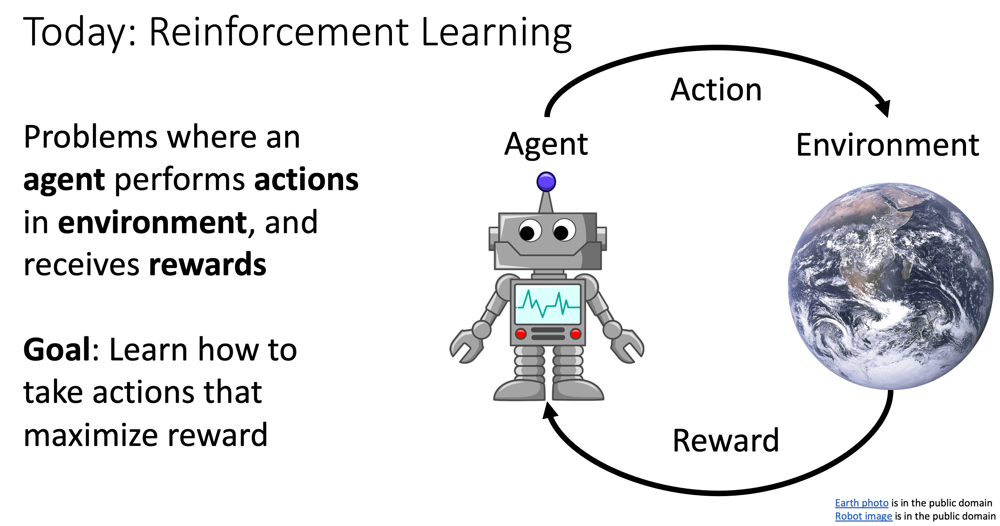
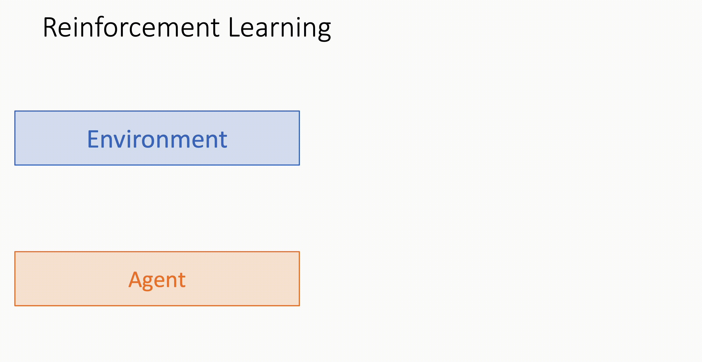
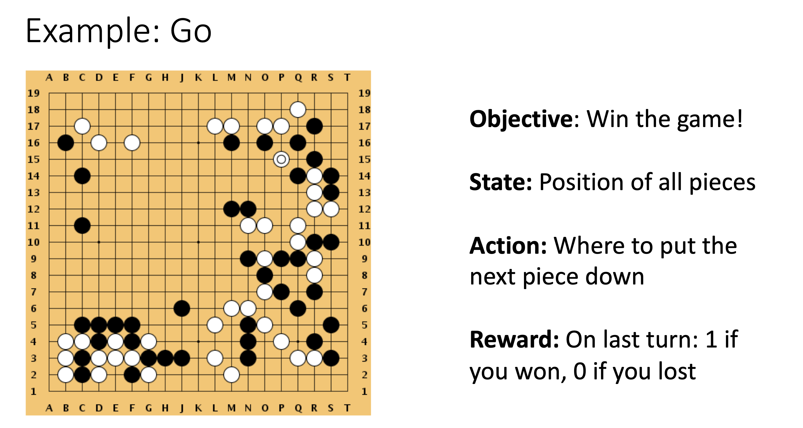

# Reinforcement Learning

## Overview

之前我们学习了监督学习和无监督学习两种机器学习范式，强化学习和这两种范式有很大的不同。强化学习中的主体分为 Agent 和 Environment，Agent 根据 Environment 的状态执行相应的动作，然后获得奖励，强化学习通过最大化 Agent 的奖励来优化它的行为，本质上 Agent 是在与 Environment 的不断交互中优化自身行为的。

强化学习的步骤可以看作：

- Environment 给 Agent 一个当前时间环境的状态 $State_t$
- Agent 根据 $State_t$ 做出根据这个状态的反应 $Action_t$
- 环境根据 Agent 的行为给它相应的奖励 $Reward_t$，同时受到 $Action_t$ 的影响变为了 $State_{t + 1}$
- 重复循环以上步骤

强化学习中有几个值得注意的点：

- Stochasticity: State 和 Reward 可能是随机的
- Credit Assignment: $Reward_t$ 可能并不直接依赖于 $Action_t$，而是之前行为的某个行为或者之前行为的总和
- Non-Differentiability: 不能反向传播，因为 Reward 和 Action 通常是离散的，这导致无法它们不可微进而无法进行梯度下降
- Non-Stationarity: Environment 是动态变化的，Agent 会接受到什么样的 State 不仅仅取决于它如何 Action

一个关于强化学习非常著名的例子就是 Alpha Go，两个 Agent 相互竞争下棋，Agent1 根据棋盘的情况做出相应的行为，Agent2 根据棋盘的情况做出相应的行为，如此往复，直到最后胜利的 Agent 获得奖励。在这个例子中可以很明显地感受到强化学习的几个特点：

- Credit Assignment: 奖励是在最后一步才进行发放，所以它是对之前所有行为的奖励
- Non-Differentiability: Agent 将棋子进行移动的这个行为是离散的，无法用连续光滑的函数进行表示，所以不可微
- Stochasticity / Non-Stationarity: 环境不是静态的，不仅仅受到单个 Agent 的影响，也可能受到其它 Agent 的影响

## Markov Decision Process

马尔可夫决策过程 (Markov Decision Process, MDP) 是强化学习的数学建模基础，用于描述 Agent 如何在 Environment 中进行决策，以最大化累计回报。MDP 是由五个元素组成的元组 $(S, A, P, R, \gamma)$:

- S, State: 所有可能环境 State 的集合
- A, Action: Agent 在特定环境 State 下可能 Action 的集合
- P, Transition Probability: 给定当前的 State 和 Action，下一个 State 的分布
- R, Reward Function: 根据当前的 State 和 Action，该时间步的 Reward 分布
- $\gamma$, Discount Factor: 取值范围 $(0, 1]$，用于衡量未来 Reward 的重要性，如果 $\gamma$ 很小，则更关注短期奖励；如果 $\gamma$ 很大，则表明长期奖励很重要

Markov Property: 当前的状态包含了所有必要的信息来决定未来的演变, $State_{t + 1}$ 完全依赖于 $State_t$ 和 $Action_t$，而不依赖于更早的状态和行为。

在强化学习中，Agent 会依据策略 (Policy) $\pi$ 来得到关于当前 State 下应该采取的 Action，一个 $\pi$ 会得到相应的路径: $s_0, a_0, r_0, s_1, a_1, r_1, ...$，目标就是找到一个最优的 $\pi^*$ 使得累计奖励最大 $max \sum_t \gamma^t r_t$。具体的步骤如下：

- Agent 根据当前环境的状态选择一个动作 $a_t ～ \pi(a|s_t)$ 
- Environment 根据当前的状态和 Agent 的动作选择一个奖励 $r_t ～ R(r|s_t, a_t)$
- Environment 根据当前的状态和 Agent 的动作得到下一个状态 $s_{t + 1} = P(s|s_t, a_t)$
- Agent 得到相应的奖励计入 $\gamma^tr_t$，然后从下一个状态 $s_{t + 1}$ 开始一直重复以上过程直到结束
- $\pi^* = arg \ max_{\pi} \ E[\sum_{t \geq 0} \gamma^t r_t | \pi]$

> 目标是找到使累计回报最大的 $\pi^*$，但是过程中有很多的随机变量比如 Initial State, Transition Probability, rewards 等等，所以我们寻找累计回报的期望最大值。

### Bellman Equation

用 Q function 来衡量一个 State-Action 对: $Q^{\pi}(s, a) = E[\sum_{t \geq 0} \gamma^t r_t | s_0=s, a_0=a, \pi]$

当 $Q^{\pi}(s, a)$ 最大时，其对应的 $\pi$ 就是 $\pi^*$。

Bellman Equation: $Q^{*}(s, a) = E_{r, s'}[r + \gamma \ \max Q^{*}(s', a')]$

直观地解释 Bellman Equation 就是说，当前最大的 Q = 当前的奖励 $r$ + 折扣因子 $\gamma$ 乘以下一状态的最大 Q。执行动作 a 后，我们获得一个奖励 r 并进入新的状态 s'，此时我们能获得的最大奖励就是在 s' 选择最优动作 a' 时所得到的 Q' 并乘以折扣因子 $\gamma$ 考虑未来的不确定性。通过迭代 Bellman Equation 就可以找到最优的 $Q^*(s, a)$。

## Q-Learning

损失函数定义为: $L(s, a) = (Q(s, a; \theta) - \gamma_{s, a, \theta})^2$，目标是使损失函数最小。

$Q(s, a; \theta)$ 是对于 $Q(s, a)$ 的近似，通过深度神经网络不断调整 $\theta$ 来使得二者近似。

> 在复杂环境中，状态和动作空间可能非常大，所以使用近似的方法来得到 Q。

$\gamma_{s, a, \theta}$ 是 Q-Learning 中的目标值，用于指导深度神经网络的训练，它通过 Bellman Equation 计算得到: $\gamma_{s, a, \theta} = E_{r, s'}[r + \gamma \ max \ Q(s', a'; \theta)]$。

## Policy Gradients

Policy Gradients 是强化学习中另一种重要的优化方法，与 Q-Learning 不同，它直接优化 Policy 而不是通过 Q 来间接优化策略。Agent 获得的奖励总和为 $R = \sum_{t = 0}^T \gamma^t r_t$，目标函数是最大化期望累计奖励: $J(\theta) = E_{τ ～ \pi_{\theta}}[R(τ)]$，其中 τ 是一个路径 ($s_0, a_0, r_0, s_1, a_1, r_1, ...$)。
